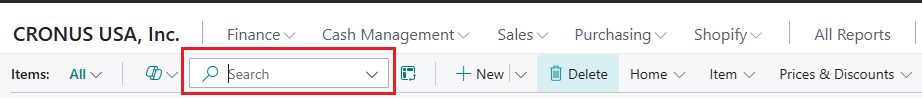
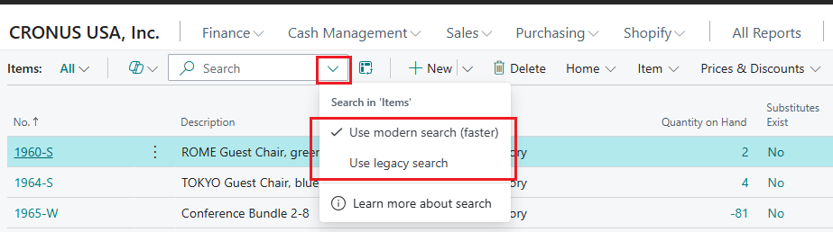

# Sort, search, and filter data in lists, reports, or XMLports

A few mechanisms are available to help you scan, find, and limit the records in a list, a report, or an XMLport. They include operations like sorting, searching, and filtering. You can apply some or all of these operations simultaneously to quickly find or analyze your data.

[!INCLUDE [about-ui-learn](includes/about-ui-learn.md)]

For reports and XMLports, as for lists, you can set filters to delimit the data that is included. However, you can't sort or search.

> [!TIP]
> When you view your data as tiles, you can search and use filtering. However, the full set of powerful features for sorting, searching, and filtering is available only when you view the records as a list. To switch from the tile view to the list view, select the  button.

<!--
When you want to search for data, such as customer names, addresses, or product groups, you enter criteria. In search criteria, you can use all the numbers and letters that you normally use in the specific field. In addition, you can use special symbols to further filter the results. There are two ways to search: using the Quick Filter or column filters.
-->

## Sorting

Sorting makes it easy to get a quick overview of your data. For example, if you have many customers, you can sort them by **Customer No.**, **Currency Code**, or **Country Region Code** value to get the overview that you need.

To sort a list, follow one of these steps:

- Select the text of a column heading to switch between ascending and descending order.
- Select the dropdown arrow in the column heading, and then select either the **Ascending** action or the **Descending** action.

> [!NOTE]
> Sorting isn't supported for images, binary large object (BLOB) fields, FlowFilters, and fields that don't belong to a table.

## Searching

The  **Search** button at the top of each list page provides a quick and easy way to reduce the number of records in a list and show only those records that contain the data that you're interested in.

To search, select the **Search** button or the <kbd>F3</kbd> key on your keyboard. Then enter the text that you're looking for in the search field. The search text that you enter can include letters, numbers, and other symbols.

In general, search tries to match text across all fields. It doesn't distinguish between uppercase and lowercase characters (in other words, it's case-insensitive). It also matches text that occurs anywhere in the field: at the beginning, in the middle, or at the end.

> [!NOTE]
> Search doesn't match values in images, BLOB fields, FlowFilters, FlowFields, and other fields that aren't part of a table.

### Choose between modern search and legacy search

[!INCLUDE [preview-banner](~/../shared-content/shared/preview-includes/preview-banner-section.md)]

[!INCLUDE [preview-note](~/../shared-content/shared/preview-includes/production-ready-preview-dynamics365.md)]

On the most common pages, such as **Customers**, **Contacts**, and **Items**, you can select the dropdown arrow in the search field and then select between two search options on the menu: **Use modern search** and **Use legacy search**.

*Legacy search* is the older search method and is available in Business Central 2024 release wave 1 and earlier. *Modern search* is a newer, faster, and more flexible search method that's available in later releases if enabled. The key difference is that legacy search finds only records that contain the exact words that you enter, in the exact order that you enter them in. Whereas modern search finds records that contain matching words in any order.

For example, the CRONUS demo company has an item that is named **LONDON Swivel Chair, blue**. If you enter `London chair` as the search text, legacy search doesn't return any results, because that exact text doesn't match any part of the item name. However, modern search finds the item by matching the words "London" and "chair" separately.

If you want to find all blue chairs in the CRONUS demo company, you might enter either `blue chair` or `chair blue` as the search text. In this case, modern search retrieves not only **LONDON Swivel Chair, blue** but also **TOKYO Guest Chair, blue**. However, once again, legacy search returns no results. To get results by using legacy search, you must enter `chair, blue` as the search text.

If you want to mimic the behavior of legacy search when you use modern search, you can enclose your search text in quotation marks, just as you can do in popular search engines. In this way, you refine the results by excluding any that aren't exact matches. For example, if you enter `"blue chair"` as the search text, modern search returns no results, because that exact text doesn't occur in any item name in the demo data.

Another difference is that modern search finds words that *start* with the letters you entered. If you enter 'hair', it doesn't find the word 'chair'.

> [!NOTE]
>
> - Modern search covers only columns that a developer designates for it. If you can't find existing data, try legacy search.
>
>   Learn more about how to designate columns for modern search in [Enable optimized text search on table fields](/dynamics365/business-central/dev-itpro/developer/devenv-table-field-text-search).
>
> - The search indexes used for modern search are updated in the background, usually within a few seconds. But in some cases, recent data changes don't immediately show up in modern search results.
>
> - If the **Use modern search** option isn't available on the dropdown menu, one of the following factors might be the cause:
>
>   - Modern search isn't enabled for your environment. Administrators can enable the **Use optimized text search in lists** feature on the **Feature Management** page. Learn more in [Enabling new and upcoming features ahead of time](admin-feature-management.md).
>   - The list doesn't include any columns that are designated for modern search.
>
> - If modern search is enabled for your environment, it's the default search method.

### Fine-tune the search by using filter criteria (legacy search only)

You can make a more exact search by using filter operators, expressions, and filter tokens. Unlike filtering, these criteria are applied across all fields when they're used in the search field. Therefore, they're less efficient than filtering.

- To find only field values that exactly match the entire search text, and the case of it, enclose the text in single quotation marks (`''`). For example, enter `'man'`.
- To find field values that start with specific text and match the case of it, add an asterisk (`*`) after the text. For example, enter `man*`.
- To find field values that end with specific text and match the case of it, add an asterisk (`*`) before the text. For example, enter `*man`.
- When you use single quotation marks (`''`) or asterisks (`*`), the search is case-sensitive. To make it case-insensitive, add an at sign (`@`) before the search text. For example, enter `@man*`.

The following table provides some examples to explain how you can use the search.

| Search criterion | Information that is found |
|---|---|
| `man` or `Man` | All records where the value of any field contains the text **man**, regardless of the case. For example, the search finds records where any field has the value **Manchester**, **manual**, or **Sportsman**. |
| `'Man'` | All records where the value of any field contains only the exact text **Man**, where the "M" is uppercase, and the "an" is lowercase. |
| `Man*` | All records where the value of any field starts with the exact text **Man**, where the "M" is uppercase, and the "an" is lowercase. For example, the search finds records where any field has the value **Manchester**, but not the value **manual** or **Sportsman**. |
| `@Man*` | All records where the value of any field starts with the text **man**, regardless of the case. For example, the search finds records where any field has the value **Manchester** or **manual**, but not the value **Sportsman**. |
| `@*man` | All records where the value of any field ends with **man**, regardless of the case. For example, the search finds records where any field has the value **Sportsman**, but not the value **Manchester** or **manual**. |

## Filtering

Filtering provides a more advanced and versatile way to control which records are included in a list, a report, or an XMLport. There are two major differences between searching and filtering, as the following table shows.

| | Searching | Filtering |
|---|---|---|
| **Applicable fields** | Search across all fields that are visible on the page. | Filter one or more fields individually. Select from any field in the table, including fields that aren't visible on the page. |
| **Matching** | Show records where field values match the search text, regardless of the text's case or placement in the field. | Show records where field values exactly match the filter, including the text's case, unless special filter symbols are entered.

By specifying filter criteria, you can show records for specific accounts or customers, dates, amounts, and other information. Only records that match the criteria are shown in the list or included in the report, batch job, or XMLport. If you specify criteria for multiple fields, only records that match all criteria are shown.

For lists, the filters are shown in a filter pane that appears to the left of the list when you activate it. For reports, batch jobs, and XMLports, the filters are visible directly on the request page.

### Filter by using option fields

For "ordinary" fields that hold data, setup date, or business data, you can set filters both by selecting data and by entering filter values. You can also use symbols to define advanced filter criteria. Learn more in the [Enter filter criteria](#enter-filter-criteria) section.

However, for fields of the **Option** type, you can set a filter only by selecting one or more available options in a dropdown list. An example of an option field is the **Status** field on the **Sales Orders** page.

> [!NOTE]
> If you select multiple options as a filter value, the relationship between the options is defined as *OR*. For example, if you select both the **Open** checkbox and the **Released** checkbox in the **Status** filter field on the **Sales Orders** page, the page shows all sales orders that are either open or released.

### Set filters on lists

For lists, you set filters by using the filter pane. To show the filter pane for a list, select the dropdown arrow next to the name of the page, and then select the **Show filter pane** action. Alternatively, select <kbd>Shift</kbd>+<kbd>F3</kbd>.

To show the filter pane for a column in a list, select the dropdown arrow, and then select the **Filter** action. Alternatively, select <kbd>Shift</kbd>+<kbd>F3</kbd>. The filter pane appears, and the selected column is shown as a filter field in the **Filter list by** section.

The filter pane shows the current filters for a list. You can set your own custom filters on one or more fields by selecting the **+&nbsp;Filter** action.

The filter pane is divided into three sections: **Views**, **Filter list by**, and **Filter totals by**:

- **Views** – Some lists include the **Views** section. *Views* are variations of the list that are preconfigured with filters. You can define and save as many views as you want for each list. The views are available to you on any device that you sign in to. Learn more in [Save and personalize list views](ui-views.md).
- **Filter list by** – This section is where you add filters on specific fields to reduce the number of records that are shown. To add a filter, select the **+&nbsp;Filter** action. Then enter the name of the field that you want to filter the list by, or select a field in the dropdown list.
- **Filter totals by** – Some lists that show calculated fields, such as amounts and quantities, include the **Filter totals by** section. Here, you can adjust various dimensions that influence the calculations. To add a filter, select the **+&nbsp;Filter** action. Then enter the name of the field that you want to filter the list by, or select a field in the dropdown list.

    > [!NOTE]
    > Filters in the **Filter totals by** section are controlled by FlowFilters in the page design. Learn about the technical aspects of FlowFilters in [FlowFilters overview](/dynamics365/business-central/dev-itpro/developer/devenv-flowfilter-overview).

By using the filter pane, you can set a simple filter directly on a list to show only records that have the same value as a selected cell. Select a cell in the list, select the dropdown arrow, and then select the **Filter to This Value** action. Alternatively, select <kbd>Alt</kbd>+<kbd>F3</kbd>.

### Set filters in reports, batch jobs, and XMLports

For reports and XMLports, the filters are visible directly on the request page. The request page shows the last-used filters according to your selection in the **Use default values from** field. Learn more in [Use default values—predefined settings](ui-work-report.md#SavedSettings).

The main **Filter** section shows the default filter fields that you use to define which records should be included in the report or XMLport. To add a filter, select the **+&nbsp;Filter** action. Then enter the name of the field that you want to filter by, or select a field in the dropdown list.

In the **Filter totals by** section, you can adjust various dimensions that influence the calculations in the report or XMLport. To add a filter, select the **+&nbsp;Filter** action. Then enter the name of the field that you want to filter by, or select a field in the dropdown list.

## Enter filter criteria

Both in the filter pane and on a request page, you enter your filter criteria in the box under the filter field.

The type of the filter field determines which criteria you can enter. For example, to filter a field that has fixed values, you can select only among those values. Learn more about special filter symbols in the [Filter criteria and operators](#FilterCriteria) and [Filter tokens](#FilterTokens) sections.

The  symbol in the column heading indicates columns that already have filters. To remove a filter, select the dropdown arrow, and then select the **Clear Filter** action.

> [!TIP]
> By learning to use key combinations (keyboard shortcuts), you can find and analyze your data more quickly. For example, select a field, select <kbd>Shift</kbd>+<kbd>Alt</kbd>+<kbd>F3</kbd> to add that field to the filter pane, enter the filter criteria, select <kbd>Ctrl</kbd>+<kbd>Enter</kbd> to return to the rows, select another field, and then select <kbd>Alt</kbd>+<kbd>F3</kbd> to filter to that value. Learn more in [Search and filter lists](keyboard-shortcuts.md#KeyboardFilter).

### Filter criteria and operators

When you enter criteria, you can use all the numbers and letters that you normally use in the field. In addition, there's a set of special symbols that you can use as operators to further filter the results. The following sections describe these symbols and explain how to use them as operators in filters.

> [!TIP]
> Learn more about how to filter dates and times in [Work with calendar dates and times](ui-enter-date-ranges.md).

> [!IMPORTANT]
> - In some situations, the value that you want to filter on might contain a symbol that is an operator. Learn more about how to handle these situations in the [Filter on values that contain symbols](#symbols) section.
> - If a single filter includes more than 200 operators, the system automatically uses parentheses (`()`) to group some expressions for processing. This behavior has no effect on the filter or the results.

#### (..) Interval

| Sample expression | Records that are shown |
|---|---|
| `1100..2100` | Numbers 1100 through 2100 |
| `..2500` | Numbers up to and including 2500 |
| `..12 31 00` | Dates up to and including 12 31 00 |
| `Bicycle..Car` | Strings "Bicycle" through "Car" when they're ordered lexicographically |
| `P8..` | Information for accounting period 8 and later |
| `..23` | From the beginning date until 23-current month-current year 23:59:59 |
| `23..` | From 23-current month-current year 0:00:00 until the end of time |
| `22..23` | From 22-current month-current year 0:00:00 until 23-current month-current year 23:59:59 | 

> [!TIP]
> If you're using a numeric keypad, the <kbd>Decimal separator</kbd> key might produce a character other than a period (.). To switch to a period, select the <kbd>Alt</kbd> key on the keyboard together with the <kbd>Decimal separator</kbd> key on the numeric keypad. To switch back, select <kbd>Alt</kbd>+<kbd>Decimal Separator</kbd> again. Learn more in [Setting the decimal separator used by numeric keyboards](ui-enter-data.md#decimal).

> [!NOTE]
> If you filter on a field of the **Text** type, lexicographic ordering is used to determine what is included in the interval. If a field of the **Text** type is used to store integers, this behavior can lead to unexpected results. For example, a filter on `10000..10042` also includes the values **100000** and **1000042**.

#### (&verbar;) Either/or

| Sample expression | Records that are shown |
|---|---|
| `1200|1300` | Numbers with 1200 or 1300 |

#### (<>) Not equal to

| Sample expression | Records that are shown |
|---|---|
| `<>0` | All numbers except 0 |

> [!TIP]
> The SQL Server option lets you combine `<>` with a wildcard expression. For example, `<>A*` means "not equal to any text that starts with *A*."

#### (>) Greater than

| Sample expression | Records that are shown |
|---|---|
| `>1200` | Numbers greater than 1200 |

#### (>=) Greater than or equal to

| Sample expression | Records that are shown |
|---|---|
| `>=1200` | Numbers greater than or equal to 1200 |

#### (<) Less than

| Sample expression | Records that are shown |
|---|---|
| `<1200` | Numbers less than 1200 |

#### (<=) Less than or equal to

| Sample expression | Records that are shown |
|---|---|
| `<=1200` | Numbers less than or equal to 1200 |

#### (&) And

| Sample expression | Records that are shown |
|---|---|
| `>200&<1200` | Numbers greater than 200 and less than 1200 |

#### ('') An exact character match

| Sample expression | Records that are shown |
|---|---|
| `'man'` | Text that exactly matches **man** and is case-sensitive |
| `''` | Text that's empty |

#### (@) Case-insensitive

| Sample expression | Records that are shown |
|---|---|
| `@man*` | Text that starts with **man** and is case-insensitive |

#### (*) An indefinite number of unknown characters

| Sample expression | Records that are shown |
|---|---|
| `*Co*` | Text that contains **Co** and is case-sensitive |
| `*Co` | Text that ends with **Co** and is case-sensitive |
| `Co*` | Text that begins with **Co** and is case-sensitive |

#### (?) One unknown character

| Sample expression | Records that are shown |
|---|---|
| `Hans?n` | Text such as **Hansen** or **Hanson** |

#### Combined format expressions

| Sample expression | Records that are shown |
|---|---|
| `5999|8100..8490` | Any records that have the number 5999 or a number in the range from 8100 through 8490 |
| `..1299|1400..` | Records that have a number that's less than or equal to 1299, or a number that's greater than or equal to 1400 (that is, all numbers except 1300 through 1399) |
| `>50&<100 `| Records that have a number that's greater than 50 and less than 100 (that is, all numbers from 51 through 99) |

### Filter on values that contain symbols

There might be cases where field values contain one of the following symbols:

- &
- (
- )
- =
- &verbar;

If you want to filter on any of these symbols, enclose the filter expression in single quotation marks (`''`). For example, to filter on records that start with the text **J & V**, the filter expression is `'J & V*'`.

This requirement applies only to the five symbols in the preceding list.

### Filter tokens

When you enter filter criteria, you can also enter *filter tokens*, which are words that have special meaning. After you enter a filter token, it's replaced by the value or values that it represents. Filter tokens make filtering easier, because you don't have to open other pages to look up values that you want to add to your filter. The following sections describe some of the tokens that you can enter as filter criteria.

> [!TIP]
> Your organization might use custom tokens. To learn about the complete set of tokens that's available to you, or to add more custom tokens, contact your administrator. Learn about the technical aspects of filter tokens in [Adding Custom Filter Tokens](/dynamics365/business-central/dev-itpro/developer/devenv-adding-filter-tokens).

#### (%me or %user) Records assigned to you

When you filter fields that contain a user ID, such as the **Assigned to User ID** field, use the `%me` or `%user` filter token to show all records that are assigned to you.

| Sample expression | Records that are shown |
|---|---|
| `%me` or `%user` | Records that are assigned to your user account |

#### (%mycustomers) Customers in My Customers

In the customer number (**No**) field, use the `%mycustomers` filter token to show all records for customers that are included in the **My Customers** list on your Role Center.

| Sample expression | Records that are shown |
|---|---|
| `%mycustomers` | Customers in the **My Customers** list on your Role Center |

#### (%myitems) Items in My Items

In the item number (**No**) field, use the `%myitems` filter token to show all records for items that are included in the **My Items** list on your Role Center.

| Sample expression | Records that are shown |
|---|---|
| `%myitems` | Items in the **My Items** list on your Role Center |

#### (%myvendors) Vendors in My Vendors

In the vendor number (**No**) field, use the `%myvendors` filter token to show all records for vendors that are included in the **My Vendors** list on your Role Center.

| Sample expression | Records that are shown |
|---|---|
| `%myvendors` | Vendors in the **My Vendors** list on your Role Center |

## Save filters

Your filters and adjustments to predefined filters are remembered throughout the session (while you remain signed in), even if you navigate away from the page. You can permanently save filters as a named view of the list by choosing the  icon in the filter pane. Learn more in [List Views FAQ](ui-views-faq.yml). Unlike filters, search text isn't kept when you leave a page and isn't saved when you save a view.

On report request pages, you can also save filters or use predefined filters. Learn more in [Use Saved Settings](ui-work-report.md#SavedSettings).

## Related information

[Searching and filtering FAQ](ui-search-filter-faq.yml)  
[Save and personalize list views](ui-views.md)  
[Work with [!INCLUDE[prod_short](includes/prod_short.md)]](ui-work-product.md)  
[Search and filter shortcuts](keyboard-shortcuts.md#KeyboardFilter)
[Analyze list data using data analysis mode](analysis-mode.md)   

[!INCLUDE[footer-include](includes/footer-banner.md)]
