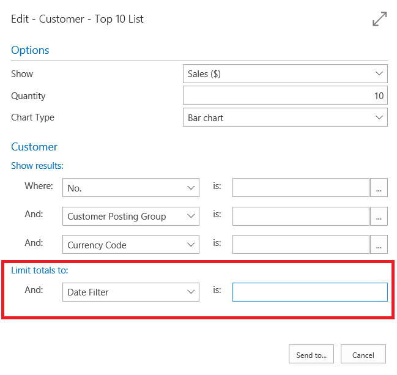

# Work with calendar dates and times

You can enter dates and times in multiple ways. [!INCLUDE[prod_short](includes/prod_long.md)] includes powerful features that accelerate data entry, or help you write complex calendar expressions. There are various places throughout the application where you can enter dates and times in fields. For example, on a sales order, you can set the shipment date. When filtering lists or report data, you can enter dates and times to pinpoint only the data that you're interested in.

[!INCLUDE [about-ui-learn](includes/about-ui-learn.md)]

## Check your region and language settings

The **My Settings** page specifies the **Region** and **Language** that you're using in the application. These settings influence how you enter dates and times.

- The **Region** setting determines how dates, times, numbers, and currencies are shown or formatted.

- For date patterns that involve words, the language of the words that you use must correspond to the **Language** setting.

> [!NOTE]
> [!INCLUDE[prod_short](includes/prod_long.md)] uses the Gregorian calendar system.

## Entering dates

In a date field, you can enter a date using the standard format for your region setting. Different regions can use different separators between the days, months, and years. For example, some regions use dashes (mm-dd-yyyy) and others use forward slashes (mm/dd/yyyy).  

> [!TIP]
> You can use any separators, even a space, and the date will automatically be changed to use separators that match your region.

> [!NOTE]
> The format in which dates are displayed on printed reports or emailed documents isn't influenced by your personal choice of region setting.

To work more productively with dates and times, you can use any of the methods or formats that are described in the following sections.

### Picking dates from the calendar

Any field displaying a calendar icon can be set using the calendar date picker. To display the calendar date picker, activate the calendar icon or select the <kbd>Ctrl</kbd>+<kbd>Home</kbd> keyboard shortcut in the field.

See also [Keyboard Shortcuts in the calendar date picker](keyboard-shortcuts.md#calendarshortcuts).

### Day\-week\-year pattern

You can enter a date as a weekday followed by a week number and, optionally, a year. For example, Mon25 or mon25 means Monday in week 25. If you don't enter a year, the year of the work date is used.

Instead of entering the entire word for the day of the week, you can enter part of the word, starting from the beginning. If there were conflicts (such as with s which could be Saturday or Sunday), the days are evaluated according to the region setting. The input is first evaluated against work date and today as well, which you want to keep in mind when abbreviating. For example, _t_ already means today, so it can't mean Tuesday or Thursday.

The week number scheme is always ISO 8601, where week 1 is the week with 4 January in it, or the week with the first Thursday of the year.

### Digit patterns

In a date field you can enter two, four, six, or eight digits:

- Two digits are interpreted as the day, and it adds the month and the year of the work date.

- Four digits are interpreted as the day and the month, and it adds the year of the work date. Your region settings determine the order of the day and month. Even if your region settings have the year before the day and month, four digits are interpreted as the day and month.

- If the date you want to enter is in the range 01/01/1950 through 12/31/2049, you can enter the year with two digits; otherwise, enter the year with four digits.

  > [!NOTE]
  > If you're using [!INCLUDE[prod_short](includes/prod_short.md)] on-premises, the two-digit year range may be different. Administrators can change the range by modifying the **CalendarTwoDigitYearMax** setting of the [!INCLUDE[prod_short](includes/prod_short.md)] server. For more information, see [Configuring Business Central Server](/dynamics365/business-central/dev-itpro/administration/configure-server-instance#General).

### Today

Enter the word for _today_, in the language specified on the **My Settings** page, to set the date on a record to today's date. Instead of entering the entire word, you can enter part of the word, starting from the beginning. For example, in English, you can enter _t_ or _tod_, as long as it isn't also the start of another word.

### Period

To filter on a specific accounting period, in a date field enter the letter p, or the word period, followed by a number that identifies the accounting period, like p2 or period4. The accounting period is relative to the fiscal year of the current work date that set in your Role Center. For example, if the work date is **03/21/22**, then _p1_, or just _p_, filters on the first accounting period of the fiscal year 2022 (such as 01/01/22..01/31/22). _p15_ filters on the 15th accounting period from the start of fiscal year 2022 (such as 03/01/23..03/31/23).

The accounting periods are defined on the **Accounting Periods** page. To view or change the accounting periods, open the page [here](https://businesscentral.dynamics.com/?page=100).

### Work Date

Use a work date to specify a date that isn't today's date on records. For example, a work date is useful when you need to set a particular date for multiple records. You specify the work date on the **My Settings** page. 

A fast way to enter the work date on records is to enter some or all of the word _work_. Start from the beginning of the word in the language in which you use [!INCLUDE[prod_short](includes/prod_long.md)]. For example, in English, you can enter _w_ or _work_. The language is also specified on the **My Settings** page.

If a work date isn't specified, today's date is used. To learn more, go to [Change Basic Settings, such as the Work Date](ui-change-basic-settings.md#work-date).

### Closing date

When you close a fiscal year, you can use closing dates to indicate that an entry is a closing entry. A closing date technically is between two dates, for example between December 31 and January 1.

To specify that a date is a closing date, put C just before the date, such as C123101. Use this format in combination with all the date patterns.

### Examples

The following table contains examples of dates using all the formats. It assumes region settings that format dates according to: **year.month.day.**, a week starting on Monday, and the English language.

|**Entry**      |**Interpretation**      |
|---------------|------------------------|
|2022.12.31.|2022.12.31.|
|221231|2022.12.31.|
|22.12.31.|2022.12.31.|
|22.12.31.|2022.12.31.|
|20221231|2022.12.31.|
|22/12,31|2022.12.31.|
|11|work date year.work date month.11.|
|1112|work date year.11.12.|
|t or today|today's date|
|p4|date range that includes the fourth accounting period, such as 04/01/20..04/30/20|
|w or work date|the working date|
|m or Monday|Monday of the work date week|
|tu or Tuesday|Tuesday of the work date week|
|sa or Saturday|Saturday of the work date week|
|s or Sunday|Sunday of the work date week|
|t23|Tuesday of week 23 of the work date year|
|t 23|Tuesday of week 23 of the work date year|
|t-1|Tuesday of week 1 of the work date year|

##   Setting ranges

To display only the data contained in that range, on lists, totals, and reports you can filter on dates, times, and datetimes with a start value and optionally an end value. The standard rules apply to the way you set date ranges.

|**Meaning**|**Sample expression (Date)**|**Data included in the filter**|
|-----------|---------------------|--------------------|
|Interval|12 15 00..01 15 01  ..12 15 00  p1..p4|Records with dates between and including 12 15 00 and 01 15 01.  Records with dates of 12 15 00 or earlier.  Date range that includes the second, third, and fourth accounting periods, such as 01/01/20..04/30/20.|
|Either/or|12 15 00\|12 16 00|Records with dates of either 12 15 00 or 12 16 00. If there are records with dates on both days, they all display.|
|Combination|12 15 00\|12 01 00..12 10 00    ..12 14 00\|12 30 00..|Records with dates of 12 15 00 or on dates between and including 12 01 00 and 12 10 00.    Records with dates of 12 14 00 or earlier, or dates of 12 30 00 or later, that is, all records except records with dates between and including 12 15 00 and 12 29 00.|

You can use any of the valid formats in date range filters. For example, mon14 3..t 4p applied on a datetime field results in a filter from 3 AM on Monday in week 14 of the current work date year until today at 4PM.

## Use date formulas

A date formula is a short, abbreviated combination of letters and numbers that specifies how to calculate dates. You can enter date formulas in various date calculation fields or filters.

> [!NOTE]
> In all data formula fields, one day is automatically included to cover today as the day when the period starts. Accordingly, for example, if you enter 1W, then the period is actually eight days because today is included. To specify a period of seven days \(one true week\) including the period starting date, then you must enter 6D or 1W-1D.

Here are some examples of how date formulas can be used:

- The date formula in the recurring frequency field in recurring journals determines how often the entry on the journal line posts.
- The date formula in the **Grace Period** field for a specified reminder level determines the period of time that must pass from the due date (or from the date of the previous reminder) before a reminder is created.
- The date formula in the **Due Date Calculation** field determines how to calculate the due date on the reminder.

The date formula can contain a maximum of 20 characters, both numbers and letters. You can use the following letters, which are abbreviations for calendar units.

|  Letter  |  Meaning  |
|----------|----------------------|
|C|Current|
|D|Day\(s\)|
|W|Week\(s\)|
|M|Month\(s\)|
|Q|Quarter\(s\)|
|Y|Year\(s\)|

You can construct a date formula in three ways.

The following example shows how to use C, for current, and a time unit.

|  Expression  |  Meaning  |
|--------------|-----------|
|CW|Current week|
|CM|Current month (last day of the month)|

The following example shows how to use a number and a time unit. A number can't be larger than 9999.

|  Expression  |  Meaning  |
|--------------|-----------|
|10D|10 days from today|
|2W|2 weeks from today|

The following example shows how to use a time unit and a number.

|  Expression  |  Meaning  |
|--------------|-----------|
|D10|The next 10th day of a month|
|WD4|The next 4th day of a week \(Thursday\)|

The following example shows how you can combine these three forms as needed.

|  Expression  |  Meaning  |
|--------------|-----------|
|CM+10D|Current month \+ 10 days|

The following example shows how you can use a minus sign to indicate a date in the past.

|  Expression  |  Meaning  |
|--------------|-----------|
|-1Y|1 year ago from today|

> [!IMPORTANT]
> If the location uses a base calendar, then the date formula that you enter in, for example, the **Shipping Time** field is interpreted according to the calendar working days. For example, 1W  means seven working days.
<!--
# Entering Date Ranges
You can set filters containing a start date and an end date to display only the data contained in that date range or time interval. Special rules apply to the way you set date ranges. Let's take the **Customer Top 10** as an example:

Here you can limit the report to a date range such as the past 2 weeks, or a total of 6 weeks, or whatever range you want. To set date ranges, you enter dates and then use either **..** or **|** to set the range. In our example, to show the top 10 customers for the first two weeks of May, you would set the date filter to *05 01 17..05 14 17*.
Here are a couple of other examples:

| Meaning | Example | Entries included |
|---|---|---|
|Equal to| 12 15 16 |Only those posted on December 15 2016.|
|Interval| 12 15 16..01 15 17  ..12 15 16|Those posted on dates between and including December 15 2016 and January 15 2017.  Those posted on December 15 2016 or earlier.|
|Either/or|12 15 16&#124;12 16 16|Those posted on either December 15 or December 16 2016. If there are entries posted on both days, they will all be displayed.|

You can also combine the various format types.

| Example | Entries included |
|---|---|
|12 15 16&#124;12 01 16..05 31 17 | Entries posted either on December 15 2016 or on dates between and including December 01 2016 and May 31 2017. |
|..12 14 16&#124;12 30 16.. | Entries posted on December 14 or earlier, or entries posted on December 30 or later - that is, all entries except those posted on dates between and including December 15 and 29. |

Note that we have used the US date format MMDDYY here. As [!INCLUDE[prod_short](includes/prod_short.md)] becomes available in other markets, you'll be able to use the formats that you are used to.

## Use Date Formulas
A date formula is a short, abbreviated combination of letters and numbers that specifies how to calculate dates. You can enter date formulas in various date calculation fields and in recurring frequency fields in recurring journals.

> [!NOTE]
> In all data formula fields, one day is automatically included to cover today as the day when the period starts. Accordingly, for example, if you enter **1W**, then the period is actually eight days because today is included. To specify a period of seven days (one true week) including the period starting date, then you must enter **6D** or **1W\-1D**.

Here are some examples of how date formulas can be used:

- The date formula in the recurring frequency field in recurring journals determines how often the entry on the journal line will be posted.

- The date formula in the **Grace Period** field for a specified reminder level determines the period of time that must pass from the due date (or from the due date of the previous reminder) before a reminder will be created.

- The date formula in the **Due Date Calculation** field determines how to calculate the due date on the reminder.

The date calculation formula can contain a maximum of 20 characters, both numbers and letters. You can use the following letters, which are abbreviations for time specifications.

|  Letter  |  Time specification  |
|----------|----------------------|
|C|Current|
|D|Day\(s\)|
|W|Week\(s\)|
|M|Month\(s\)|
|Q|Quarter\(s\)|
|Y|Year\(s\)|

You can construct a date formula in three ways.

The following example shows how to use **C**, for current, and a time unit.

|  Expression  |  Meaning  |
|--------------|-----------|
|CW|Current week|
|CM|Current month|

The following example shows how to use a number and a time unit. A number cannot be larger than 9999.

|  Expression  |  Meaning  |
|--------------|-----------|
|10D|10 days from today|
|2W|2 weeks from today|

The following example shows how to use a time unit and a number.

|  Expression  |  Meaning  |
|--------------|-----------|
|D10|The next 10th day of a month|
|WD4|The next 4th day of a week \(Thursday\)|

The following example shows how you can combine these three forms as needed.

|  Expression  |  Meaning  |
|--------------|-----------|
|CM\+10D|Current month \+ 10 days|

The following example shows how you can use a minus sign to indicate a date in the past.

|  Expression  |  Meaning  |
|--------------|-----------|
|-1Y|1 year ago from today|

> [!IMPORTANT]
> If the location uses a base calendar, then the date formula that you enter in, for example, the **Shipping Time** field is interpreted according to the calendar working days. For example, **1W**  means seven working days.

-->

## Entering times

When you enter times, you can insert any nonspace separators that you want between the units. If you use double digits for each unit up to milliseconds, then it isn't required.

You only have to write the largest units that you require; the rest are set to zero. You can also leave out any AM/PM indicator.

The following table lists the various ways in which times can be entered and how they're interpreted. It assumes region settings that format times according to **Hours:Minutes:Seconds.Milliseconds** and use the AM and PM indicators.

|**Entry**      |**Interpretation**      |
|---------------|------------------------|
|05:23:17|05:23:17|
|5|05:00:00|
|5AM|05:00:00|
|5P|17:00:00|
|12|12:00:00|
|12A|00:00:00|
|12P|12:00:00|
|17|17:00:00|
|5:30|05:30:00|
|0530|05:30:00|
|5:30:5|05:30:05|
|053005|05:30:05|
|5:30:5,50|05:30:05.5|
|053005050|05:30:05.05|

> [!NOTE]
> Milliseconds are interpreted as decimal notation. So, for example, 3, 30, and 300 all mean 300 milliseconds, while 03 means 30 and 003 means 3 milliseconds.

> [!IMPORTANT]
> You can't use 24:00 to mean midnight, or use any value greater than 24:00.

The word for *time* in the language used by [!INCLUDE[prod_short](includes/prod_long.md)] is the current time on your computer or mobile device. You can enter a part of the word starting from the beginning, such as **t** or **TIM**.

## Entering combined dates and times

[!INCLUDE [datetimes](includes/datetimes.md)]

## Entering duration

Some fields in the application represent a duration, or amount of elapsed time, instead of a specific date or time. You enter a duration as a number followed by its unit of measure.

Here are some examples.

|**Duration**|**Unit of measure**|
|------------|-------------------|
|2h|2 hrs|
|6h 30 m|6 hrs 30 mins|
|6.5h|6 hrs 30 mins|
|90m|1 hr 30 mins|
|2d 6h 30m|2 days 6 hrs 30 mins|
|2d 6h 30m 56s 600ms|2 days 6 hrs 30 mins 56 secs 600 msecs|

You can also enter a number that automatically converts to a duration. The number converts according to the default unit of measure that is specified for the duration field.

It's easy to find out which unit of measure a duration field uses. Enter a number, and then look at the unit of measure it converts to.

For example, if the unit of measure is hours, the number 5 converts to 5 hrs.

## Related information

[Work with [!INCLUDE[prod_short](includes/prod_long.md)]](ui-work-product.md)  
[Date Calculation for Purchases](purchasing-date-calculation-for-purchases.md)  
[Entering Criteria in Filters](ui-enter-criteria-filters.md)  

[!INCLUDE[footer-include](includes/footer-banner.md)]
