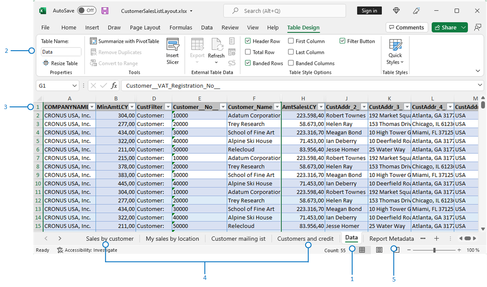

# Working with Microsoft Excel layouts

Microsoft Excel report layouts are based on Excel workbooks (.xlsx files). With them, you can create reports that include familiar Excel features for summarizing, analyzing, and presenting data such as formulas, PivotTables, and PivotCharts.

This article explains some important things you need to know to get started with Excel layouts.

## Why use Excel layouts?

Benefits of using Excel layouts:

- You can create your own report layouts with Excel, either from scratch or based on an existing layout.
- An Excel report layout can contain multiple worksheets, be interactive and use visualizations, pivot tables, and slicers.
- View raw data from the report dataset, which helps you understand how the report works and where the data in visuals comes from.
- Use built-in Microsoft Office features to do post-processing on rendered reports, including:
  - [Protecting worksheets](https://support.microsoft.com/office/protect-a-worksheet-3179efdb-1285-4d49-a9c3-f4ca36276de6)
  - [Applying sensitivity labels](https://support.microsoft.com/office/apply-sensitivity-labels-to-your-files-and-email-in-office-2f96e7cd-d5a4-403b-8bd7-4cc636bae0f9)
  - [Adding comments and notes](https://support.microsoft.com/office/insert-comments-and-notes-in-excel-65f504d8-160b-4a05-ac30-46fbd5227a52)
  - [Forecasting and analysis](https://support.microsoft.com/office/introduction-to-what-if-analysis-22bffa5f-e891-4acc-bf7a-e4645c446fb4)
- Use installed add-ins and app integrations, such as Power Automate flows or OneDrive.

> [!TIP]
> With OneDrive integration set up, when you run a report with an Excel layout, the Excel workbook file is copied to OneDrive and then opened in Excel online. For more information, see [Save Excel workbooks and report files in OneDrive](./across-onedrive-overview.md#save-excel-workbooks-and-report-files-in-onedrive)

## Get started

There are basically two tasks involved in setting up an Excel layout for a report:

1. Create the new Excel layout file.
2. Add the new layout to the report.

## Task 1: Create the Excel layout file

There are several ways to create an Excel layout file for a report:

* From any report.
* From an existing Excel report layout.
* From Visual Studio Code.

### [From any report](#tab/any-report)

Follow these steps to create an Excel layout from any report, regardless of the current layout type. The Excel layout contains the required **Data** sheet and table, and a **Report Metadata** sheet.

1. [!INCLUDE[open-report-layouts-page](includes/open-report-layouts-page.md)]
2. On the **Report Layouts** page, choose any layout for the report, then choose the **Run Report** action.
3. On the report's request page, choose **Send to**, then **Microsoft Excel Document (data only)**, and then **OK**.

   This step downloads an Excel workbook that contains the report dataset.
4. Open the downloaded file in Excel, make your changes, and then save the file.

### [From another Excel report layout](#tab/other-layout)

If there's already an Excel layout for a report, you can use the existing layout as a starting point. There are two approaches to getting a copy of the layout. You can either export the existing layout from the **Report Layouts** page or download the layout from the report's request page. Both ways download an Excel layout file that includes all the sheets of the existing file. The difference is when you download it from the request page, the layout includes actual data. The data isn't required, but it helps when you design the layout.

**Approach 1: Export the layout from the Report Layouts page**

1. [!INCLUDE[open-report-layouts-page](includes/open-report-layouts-page.md)]
2. Select the Excel layout from the list, and then choose the **Export Layout** action.
3. Open the file in Excel, make your changes, and then save the file.

**Approach 2: Download the layout from the report's request page**

1. [!INCLUDE[open-report-layouts-page](includes/open-report-layouts-page.md)]
2. On the **Report Layouts** page, choose any layout for the report, and then choose the **Run Report** action.
3. On the report's request page, choose **Download**.
4. Open the file in Excel, make your changes, and then save the file.

### [From Visual Studio Code](#tab/from-code)

Using Visual Studio Code is the most advanced way to create an Excel report layout. It requires knowledge of AL code and is intended for programmers. In this approach, the Excel layouts are part of an extension package you install. Learn more at [Creating an Excel Layout Report](/dynamics365/business-central/dev-itpro/developer/devenv-howto-excel-report-layout) in the Developer and IT Pro help.

---

## Task 2: Add the Excel layout to the report

When you have the Excel layout file, the next task is to add it as a new layout for the report.

1. [!INCLUDE[open-report-layouts-page](includes/open-report-layouts-page.md)]
2. Choose **New Layout**.
3. Set **Report ID** to **Report**.
4. In the **Layout Name** field, enter a name.
5. In the **Format Options** field, choose **Excel**.
6. Select **OK**, and then do one of the following steps to upload the layout file for the report:

   [!INCLUDE[file-upload](includes/file-upload.md)]

   The selected file is uploaded to the layout, and the **Report Layouts** page opens.
8. To review the report in the new layout, choose the layout from the list, and then select **Run Report**.

<!--

**Data** sheet
  - An Excel layout must contain a sheet named **Data**.
  - The **Data** sheet must include a table named **Data**.

**Data** table
  - The **Data** sheet must include a table named **Data**.
  - The table must have at least one column and can only include columns that are also in the report dataset.
  - The table must start in the first cell **A1** of the **Data** sheet.

3. Report metadata 
-->

## Understanding Excel layouts

There are a few things you need to know or consider when you create or change Excel layouts. Every Excel layout must have a **Data** sheet and a **Data** table. These elements define the business data that you can work with from [!INCLUDE [prod_short](includes/prod_short.md)]. The **Data** sheet links the layout to the business data, which is the basis for the calculations and visualizations that you present on other sheets.

For the layout to work, there are some requirements to the structure of the Excel workbook that must be met. The following diagram and table outline the elements of an Excel layout and the requirements.

|No.|Element|Description|Mandatory|
|---|-------|----|---|
|1|**Data** sheet|<ul><li>Must have the name **Data**.</li><li>Can only include one table, which must be named **Data**.</li></ul>| | 
|2|**Data** table|<ul><li>Must have the name **Data**.</li><li>Must have at least one column.</li><li>Can only include columns that are in the report dataset.</li><li>Must start in the first cell **A1** of the **Data** sheet.</li></ul>||
|3|Presentation sheets|<ul><li>Used to present data.</li><li>Data comes from the **Data** sheet. </li></ul>||
|4|**Report Metadata** sheet|<ul><li>Automatically included if the layout was created by exporting another Excel report.</li><li>Contains general information about the report.</li><li>Can be deleted.</li></ul>|

In summary, you can or shouldn't do the following things on the **Data** sheet:

- You can delete or hide columns.
- You can place the sheets in any order, with the **Data** sheet first or last.
- Don't change the name of **Data** sheet, **Data** table, or columns.
- Don't add any columns unless they're included in the report dataset.

## Related information

[Creating an Excel layout report (developer documentation)](/dynamics365/business-central/dev-itpro/developer/devenv-howto-excel-report-layout?toc=/dynamics365/business-central/toc.json)  
[Managing Report Layouts](ui-manage-report-layouts.md)  
[Change the Current Report Layout](ui-how-change-layout-currently-used-report.md)  
[Import and Export a Custom Report or Document Layout (Legacy)](ui-how-import-and-export-report-layout.md)  
[Analyzing Report Data with Excel](report-analyze-excel.md)  
[Working with Reports](ui-work-report.md)  
[Working with [!INCLUDE[prod_short](includes/prod_short.md)]](ui-work-product.md)  

[!INCLUDE[footer-include](includes/footer-banner.md)]
