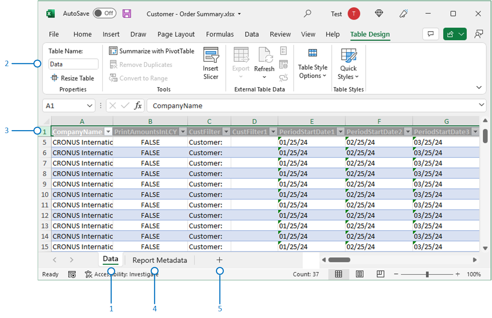

# Working with Excel Layouts

Excel report layouts are based on Microsoft Excel workbooks (.xlsx files). They let you create reports by using familiar Excel features for summarizing, analyzing, and presenting data, like formulas, PivotTables and PivotCharts.

## Why use Excel layouts?

Here are some more benefits of using Excel layouts:

- Create interactive reports using visualizations like slicers
- View raw data from the report dataset, which can help you better understand how the report works and where the data on visuals comes from
- Use built-in Office features to do post-processing on rendered reports, like:
  - [protecting the worksheets](https://support.microsoft.com/en-us/office/protect-a-worksheet-3179efdb-1285-4d49-a9c3-f4ca36276de6)
  - [applying sensitity labels](https://support.microsoft.com/en-us/office/apply-sensitivity-labels-to-your-files-and-email-in-office-2f96e7cd-d5a4-403b-8bd7-4cc636bae0f9)
  - [Add comments and notes](https://support.microsoft.com/en-us/office/insert-comments-and-notes-in-excel-65f504d8-160b-4a05-ac30-46fbd5227a52)
  - [forcasting and analysis](https://support.microsoft.com/en-us/office/introduction-to-what-if-analysis-22bffa5f-e891-4acc-bf7a-e4645c446fb4) 
- Use installed add-ins and app integrations, like Power Automate flows or OneDrive.

## Add a new layout from a file

1. Choose the  icon, enter **Report Layouts**, and then choose the related link.

    The **Report Layouts** page lists all the reports layouts that are available.
2. Choose **New Layout**.
3. Set the **Report ID** field to the ID of the report you want to create the layout for. 

   > [!TIP]
   > If you select an existing layout for the report from the **Report Layouts** page, the **Report ID** field will be filled in for you.

4. In the **Layout Name** field, type a name for the layout. This name is used to identify the report layout, so make sure it is descriptive enough.

5. Set the **Format Options** field to the layout type.
6. On the **Choose layout file** page, select **Choose**.
7. Find the layout file, select it, then choose **Open**.

The layout has been added. To try it out, select You can now modify the custom layout as needed.

## Create an Excel Layout from a Report

The easiest and quickest way to create an Excel layout is from an existing report.

1. Run the report.
2. On the report request page, select **Send to** > **Microsoft Excel Document (data only)** > **OK**.

   This step downloads an Excel workbook that contains the report dataset.
3. Open the downloaded Excel workbook, and make changes.
4. Go to the Report Layouts page.
5. Select **New Layout**.
6. Set the **Report ID** to report.
7. Enter a name in  **Layout Name**.
8. Set **Format Options** to **Excel**.
9. Select **OK**.
10. Find and select the Excel workbook, then select **Open**.

## Learn about the elements of an Excel layout

There are two elements every Excel layout must include: **Data** sheet and **Data** table. In short, these elements comprise the dataset of the report that you use in calculations and visualizations that you want to present on other sheets. There are specific requirements on the  **Data** sheet and **Data** table. If the requirements aren't met, you'll have problems using the layout.

|No.|Element|Description|Mandatory|
|---|-------|----|---|
|1|**Data** sheet|<ul><li>Must have the name **Data**</li><li>Can only include one table named **Data**</li></ul>|yes| 
|2 and 3|**Data** table|<ul><li>Must have the name **Data**</li><li>Must have at least one column and can only include columns that are also in report dataset.</li><li>Must start in the first cell A1 of the **Data** sheet</li></ul>|
|3|**Report Metadata** sheet|<ul><li>Automatically included if the layout was created by exporting another report as Excel</li><li>Contains general information about the report</li></ul>|no
|4|Additinal data sheets|Used to presents.|no|

<!--

**Data** sheet
  - An Excel layout must contain a sheet named **Data**.
  - The **Data** sheet can only include one table named **Data**.

**Data** table
  - The **Data** sheet must include a table that has the name **Data**.
  - The table must have at least one column and can only include columns that are also in report dataset.
  - The table must start in the first cell A1 of the **Data** sheet.

3. Report Metadata 
-->
## See Related Training at [Microsoft Learn](/learn/modules/change-documents-dynamics-365-business-central/index)

## See Also

[Managing Report Layouts](ui-manage-report-layouts.md)  
[Change the Current Report Layout](ui-how-change-layout-currently-used-report.md)  
[Import and Export a Custom Report or Document Layout](ui-how-import-and-export-report-layout.md)  
[Working with Reports, Batch Jobs, and XMLports](ui-work-report.md)  
[Prepare Financial Reporting with Account Schedules and Account Categories](bi-how-work-account-schedule.md) 
[Business Intelligence](bi.md)  
[Working with [!INCLUDE[prod_short](includes/prod_short.md)]](ui-work-product.md)  
[Analyzing Report Data with Excel](report-analyze-excel.md).

[!INCLUDE[footer-include](includes/footer-banner.md)]