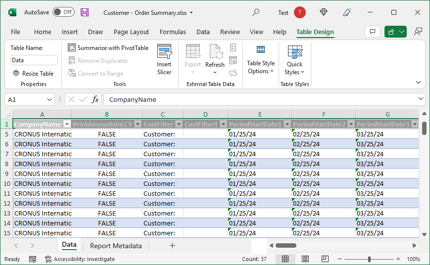

# Working with Excel Layouts

Excel report layouts are based on Microsoft Excel workbooks (.xlsx files). They let you create reports by using familiar Excel features for summarizing, analyzing, and presenting data, like formulas, PivotTables and PivotCharts.

This article explains some of the most important things you need to know to get started with Excel layouts.

## Why use Excel layouts?

Here are some more benefits of using Excel layouts:

- Create interactive reports using visualizations like slicers
- View raw data from the report dataset, which can help you better understand how the report works and where the data on visuals comes from
- Use built-in Office features to do post-processing on rendered reports, like:
  - [protecting the worksheets](https://support.microsoft.com/en-us/office/protect-a-worksheet-3179efdb-1285-4d49-a9c3-f4ca36276de6)
  - [applying sensitity labels](https://support.microsoft.com/en-us/office/apply-sensitivity-labels-to-your-files-and-email-in-office-2f96e7cd-d5a4-403b-8bd7-4cc636bae0f9)
  - [Add comments and notes](https://support.microsoft.com/en-us/office/insert-comments-and-notes-in-excel-65f504d8-160b-4a05-ac30-46fbd5227a52)
  - [forcasting and analysis](https://support.microsoft.com/en-us/office/introduction-to-what-if-analysis-22bffa5f-e891-4acc-bf7a-e4645c446fb4) 
- Use installed add-ins and app integrations, like Power Automate flows or OneDrive.

## Understanding Excel layouts

You have a lot of flexibility when designing Excel layouts But there are couple elements every Excel layout must include: a **Data** sheet and its  **Data** table. These elements form the basis of the layout by defining the business data from Business Central that you can work with. You can can think of the **Data** sheet as a kind contract between the layout in the business data. You'll use this data as the source of calculations and visualizations that you want to present on other sheets.

There are also specific requirements on the  **Data** sheet and **Data** table. If the requirements aren't met, you'll have problems using the layout. The following diagram and table outline the elements of an Excel layouts and some of the requirements.

|No.|Element|Description|Mandatory|
|---|-------|----|---|
|1|**Data** sheet|<ul><li>Must have the name **Data**</li><li>Can only include one table, and the table must be named **Data**</li></ul>| | 
|2, 3|**Data** table|<ul><li>Must have the name **Data**</li><li>Must have at least one column.</li><li>Can only include columns that in report dataset You can delete and hide columns</li><li>Must start in the first cell **A1** of the **Data** sheet</li></ul>|| 
|4|**Report Metadata** sheet|<ul><li>Automatically included if the layout was created by exporting another report as Excel</li><li>Contains general information about the report</li></ul>|
|5|Additional data sheets|Used to present data.||

To summarize what you can and can't do on the **Data** sheet:

- Don't change the name of **Data** sheet, **Data** table, or columns.
- You can delete or hide columns, but you don't add any columns that aren't in the report dataset.

## Get Started

There are basically two tasks involved in setting up an Excel layout on a report:

1. Create the new Excel layout file.
2. Add the new layout to the report.

## Create the Excel layout

There are three ways to create an Excel layout file for a report.

- From any report
- From an existing Excel layout
- From AL code

### Create an Excel layout from any report

You can use the following steps to create an Excel layout from any report, regardless of the current layout type. The Excel layout will contain the required **Data** sheet and table, a **Report Metadata**, and nothing else.

1. Choose the  icon, enter **Report Layouts**, and then choose the related link.
2. In the **Report Layouts** list, select any layout for the report, then choose the **Run Report** action.
3. On the report request page, select **Send to** > **Microsoft Excel Document (data only)** > **OK**.

   This step downloads an Excel workbook that contains the report dataset.
4. Open the downloaded file in Excel, make changes, then save the file.

### Create an Excel layout from another Excel layout

If there's already an Excel layout for a report, you use the existing layout as a starting point. There are two ways to get a copy of the layout. You can export the existing layout from the **Report Layouts** page or download the layout from the report's request page. Both ways download pretty much the same Excel layout file, which includes all sheets of the existing file. The difference is that from request page, the layout will include actual data. The data isn't required but it helps when designing the layout.

- Export the layout from the **Report Layouts** page

    1. Choose the  icon, enter **Report Layouts**, and then choose the related link.
    2. Select the Excel layout from the list, then choose the **Export Layout** action from the top of the page.
    3. Open the file in Excel, make the changes, then save the file.

- Download the layout from the report's request page

    1. Choose the  icon, enter **Report Layouts**, and then choose the related link.
    2. In the **Report Layouts** list, select any layout for the report, then choose the **Run Report** action.
    3. On the report request page, select **Download**.
    4. Open the file in Excel, make the changes, then save the file.

### Create an Excel layout from AL code

This way is the most advanced. It requires knowledge of AL code, so it target programmers. In this case, the Excel layouts are part of an extension package that you install. For more information, see [Creating an Excel Layout Report](/dynamics365/business-central/dev-itpro/developer/devenv-howto-excel-report-layout) in the Developer and IT Pro help.

## Add the Excel Layout to the report

Once you have the Excel layout file, the next task is to add it as a layout for the report.

1. Choose the  icon, enter **Report Layouts**, and then choose the related link.
2. Select **New Layout**.
3. Set the **Report ID** to report.
4. Enter a name in  **Layout Name**.
5. Set **Format Options** to **Excel**.
6. Select **OK**.
7. Find and select the Excel workbook, then select **Open**.

<!--

**Data** sheet
  - An Excel layout must contain a sheet named **Data**.
  - The **Data** sheet can only include one table named **Data**.

**Data** table
  - The **Data** sheet must include a table that has the name **Data**.
  - The table must have at least one column and can only include columns that are also in report dataset.
  - The table must start in the first cell A1 of the **Data** sheet.

3. Report Metadata 
-->

## See Related Training at [Microsoft Learn](/learn/modules/change-documents-dynamics-365-business-central/index)

## See Also

[Managing Report Layouts](ui-manage-report-layouts.md)  
[Change the Current Report Layout](ui-how-change-layout-currently-used-report.md)  
[Import and Export a Custom Report or Document Layout](ui-how-import-and-export-report-layout.md)  
[Working with Reports, Batch Jobs, and XMLports](ui-work-report.md)  
[Prepare Financial Reporting with Account Schedules and Account Categories](bi-how-work-account-schedule.md) 
[Business Intelligence](bi.md)  
[Working with [!INCLUDE[prod_short](includes/prod_short.md)]](ui-work-product.md)  
[Analyzing Report Data with Excel](report-analyze-excel.md).

[!INCLUDE[footer-include](includes/footer-banner.md)]