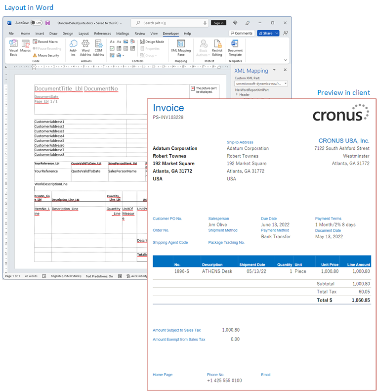
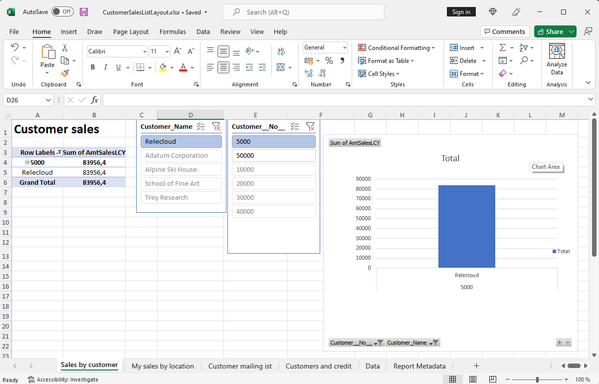
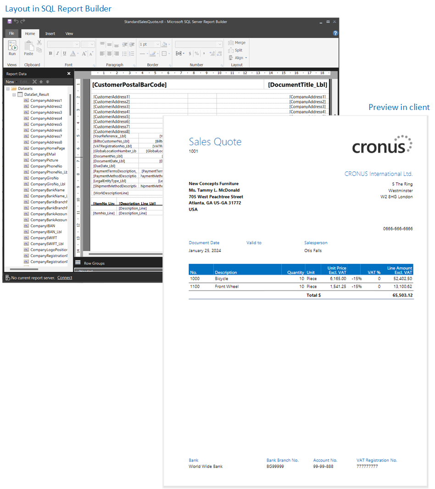

# Report and document layouts overview

A report layout controls content and format of the report. For example, the data fields in the report dataset that appear on the report, how they're arranged, the text style, images, and so on. From [!INCLUDE[prod_short](includes/prod_short.md)], you can change which layout is used on a report, create new layout, or modify the existing layouts.

> [!NOTE]  
> In [!INCLUDE[prod_short](includes/prod_short.md)], the term "report" also covers externally facing documents, such as sales invoices and order confirmations that you send to customers as PDF files.

You can also use report layouts to add content to email messages. For example, report layouts can save time and help ensure consistency by reusing the same content when you communicate with your customers. To use custom report layouts with email, the file type for the layout must be Word. You can't use the RDLC file type. Learn more in [Set Up Reusable Email Texts and Layouts](admin-how-setup-email.md#set-up-reusable-email-texts-and-layouts).

## Introduction

A report layout sets up the following things:

* The label and data fields to include from the dataset of the [!INCLUDE[prod_short](includes/prod_short.md)] report.
* The text format, such as font type, size, and color.
* The company logo and its position.
* General page settings, such as margins and background images.

You can set up multiple layouts for a report, and then switch between them to suit different reporting needs.

<!--You can use one of the built-in report layouts or you can create custom report layouts and assign them to your reports as needed. Learn more in [Create a Custom Report or Document Layout](ui-how-create-custom-report-layout.md).-->

There are two important aspects of report layouts that influence how you work with them:

* The **Layout Type** indicates the kind of file that the layout is based on.
* The **Layout Source** indicates the origin of the layout.

## Layout types

There are four types of layouts that you can use for reports:

* Word
* RDLC
* Excel
* External

### Word

Word layouts are based on Word documents (.docx file type). Word layouts enable you to design report layouts by using Microsoft Word. A Word layout determines the report's content - controlling how that content elements are arranged and how they look. A Word layout document typically uses tables to arrange content, where the cells can contain data fields, text, or pictures.

<!-- -->

Learn more in [Work with Word Layouts](ui-how-add-fields-word-report-layout.md).

### Excel

Excel layouts are based on Microsoft Excel workbooks (.xlsx file type). They let you create reports by using familiar Excel features for summarizing, analyzing, and presenting data with tools like formulas, PivotTables, PivotCharts, and more.

Learn more in [Work with Excel Layouts](ui-excel-report-layouts.md).

### RDLC

RDLC layouts are based on client report definition layout files (.rdl or .rdlc file types). These layouts are created and modified by using SQL Server Report Builder or Microsoft RDLC Report Designer. The design concept for RDLC layouts is similar to Word layouts, where the layout determines what fields to show and how they're arranged. However, designing RDLC layouts is more advanced than Word layouts.

Learn more in [Work with RDLC Layouts](ui-rdlc-report-layouts.md).

### External

An external layout type refers to an advanced type designed for specific reports. The reports and the layouts themselves are typically provided by partners, not Microsoft. The actual file type of the layout varies depending on the provider.

Learn more in [Developing a Custom Report Render](/dynamics365/business-central/dev-itpro/developer/devenv-report-custom-render).

## Layout sources

In addition to the type, layouts are further divided into three categories, based on their source or origin.

* Extension layouts

   Extension layouts are layouts that are part of an extension installed in a [!INCLUDE [prod_short](includes/prod_short.md)] environment. These layouts are typically standard layouts provided by Microsoft, for example, in the base application. Or, they could be layouts that are included in extensions from other software providers. You can identify extension layouts on the **Report Layouts** page because the **Extension** column shows the extension name and publisher.

* User-defined layouts

   The other source of layouts is the people who use [!INCLUDE [prod_short](includes/prod_short.md)]. People with the right permissions can add new layouts in various ways. For example, you could start from an existing extension layout or a user-defined layout. You can identify user-defined layouts on the **Report Layouts** page because the **Extension** column is blank.

   Learn more in [Get Started Creating Report Layouts](ui-get-started-layouts.md).

* Custom layouts (obsolete)

  Custom layouts are also layouts that users create. The difference is that these layouts are created from the now obsolete **Custom Report Layouts** page, and they can only be Word and RDLC type. Although you can still create custom layouts, they're being phased out in favor of user-defined layouts.

  Learn more in [(Obsolete) Create and Modify Custom Report Layouts](ui-how-create-custom-report-layout.md).

To learn more about which type is best for you, go to [Decide what type of layout you want](ui-get-started-layouts.md#decide).

> [!IMPORTANT]
> One important thing to remember is that you can't modify extension layouts from the [!INCLUDE [prod_short](includes/prod_short.md)] client. For example, you can't change the layout name or type, or upload and replace it with another version. If you try, an error message displays. You can create a user-defined or custom layout based on the extension layout instead.

<!--
### Built-in and custom report layouts

[!INCLUDE[prod_short](includes/prod_short.md)] includes several built-in layouts. Built-in layouts are predefined layouts that are designed for specific reports. [!INCLUDE[prod_short](includes/prod_short.md)] reports will have a built-in layout as either an RDLC report layout, Word report layout, or in some cases both. You can’t modify a built-in report layout from [!INCLUDE[prod_short](includes/prod_short.md)] but you use them as a starting point for building your own custom report layouts.

Custom layouts are report layouts that you design to change the appearance of a report. You typically create a custom layout based on a built-in layout, but you can create them from scratch or from a copy of an existing custom layout. Custom layouts enable you to have multiple layouts for the same report, which you switch among as needed. For example, you can have different layouts for each [!INCLUDE[prod_short](includes/prod_short.md)] company, or you can have different layouts for the same company for specific occasions or events, like a special campaign or holiday season.

Deciding on whether to use a Word, Excel, or RDLC layout type will depend on how you want the generated report to look and your knowledge of tools for creating the layouts, like Word, Excel, and SQL Server Report Builder.

* The general design concepts for Word and RDLC layouts are similar. However each type has certain design features that affect how the generated report appears in [!INCLUDE[prod_short](includes/prod_short.md)]. This means that the same report might look different when using the Word report layout compared to the RDLC report layout.

* The process for setting up Word, Excel, and RDLC report layouts on reports is the same. The main difference is in the way you modify the layouts. Word and especially Excel layouts are typically easier to create and modify than RDLC report layouts because you use Word and Excel. RDLC report layouts are modified by using SQL Server Report builder, which targets more advanced users.

* Not all reports and document have a dataset that is optimized for use with an Excel layout. For example, aggregations and complex calculations work best with RDLC or Word layouts. The same is true for documents.

For information about how to switch the layout currently used on a report, see [Set the Layout Used by a Report](ui-set-report-layout.md).

-->

## View report layout lifecycle telemetry

You can set up [!INCLUDE[prod_short](includes/prod_short.md)] to send data to an Application Insights resource in Microsoft Azure about the actions users take on report layouts, like adding, modifying, deleting, and more. Then, using Azure Monitor, you create reports and set up alerts on the gathered data. Learn more in the following articles of the Developer and IT Pro help:

* [Monitoring and Analyzing Telemetry - Enabling Application Insights](/dynamics365/business-central/dev-itpro/administration/telemetry-overview?toc=/dynamics365/business-central/toc.json#enable)
* [Analyzing report layout lifecycle telemetry](/dynamics365/business-central/dev-itpro/administration/telemetry-report-layout-lifecycle-trace?toc=/dynamics365/business-central/toc.json)

## Related information

[Update Custom Report Layouts](ui-update-report-layouts.md)  
[Create and Modify Custom Report Layouts](ui-how-create-custom-report-layout.md)  
[Import and Export a Custom Report or Document Layout](ui-how-import-and-export-report-layout.md)  
[Define Special Document Layouts for Customers and Vendors](ui-define-customer-vendor-document-layouts.md)  
[Send Documents by Email](ui-how-send-documents-email.md)  
[Work with Reports, Batch Jobs, and XMLports](ui-work-report.md)  
[Work with [!INCLUDE[prod_short](includes/prod_short.md)]](ui-work-product.md)  

[!INCLUDE[footer-include](includes/footer-banner.md)]
