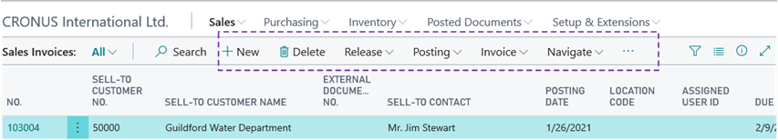
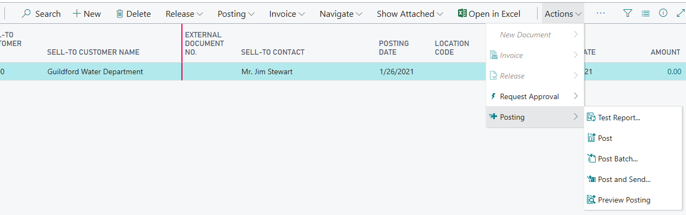

# Personalizing Your Workspace

You can customize, or *personalize*, your workspace to suit your work and preferences by changing pages so that they display only the information you need, where you need it. The personalization changes that you make will only affect what you see, not what other users see.

Depending on the type of page and what it includes, you can do various things, like moving or hiding fields, columns and actions, moving and hiding entire parts, and more.
<!--
-   Add, move, and remove fields.
-   Add, move, and remove columns in a list.
-   Change the freeze pane of columns in a list. The freeze pane locks one or more columns to the left side of a list so that are always present, even when you scroll horizontally.
-   Adjust the width of columns in a list.
-   Move and remove Cues (tiles).
-   Move and remove parts. Parts are subdivisions or areas on a page that contain things like multiple fields, another page, a chart, or tiles.

> [!NOTE]
> In addition to what users can personalize, administrators and super users can override users' personalizations and define which features are accessible in all or specific companies. For more information, see [Customizing Business Central](ui-customizing-overview.md).

-->
## How to personalize a page

1. In the upper-right corner, select the  icon, and then choose **Personalize**.

    The **Personalizing** banner appears at the top to indicate that you can start making changes.

    

2.  Go to a page that you want to personalize.

    If you see a  or  in the banner, you cannot personlize the page. For more details, see [Why Can't I Personalize the Page](ui-personalization-locked.md).

3.  Point to an area that you want to personalize, such as a field or column header in a list. Anything that you can personalize is immediately highlighted with an arrowhead or border. See the [next section](#What) for details about what you can do.

4.  You can continue to make changes on the same page or open another page. Your changes are automatically saved as you make them. When you are done, in the **Personalizing** banner, choose **Done**.

## What you can personalize

|What do you want to do|How to do it|Remarks|
|----|------------|-------|
|Move something, like a field, column in list, tile, action, or part|Point anywhere on what you want to move, and drag it to its new location. The location is indicated by either a thick horizontal or vertical line.   indicates that you cannot move the element to the selected location.|Parts are subdivisions or areas on a page that contain things like multiple fields, another page, a chart, or tiles.  For more details about action personalization, see the [next section](ui-personalization-user.md#Action). |
|Hide something, like a field, column in list, tile, or part.|Select the arrowhead, and choose <b>Hide</b>.|If the field you hide is also shown in the FastTab heading when the FastTab is collapsed, the field will no longer appear there.|
|Add a field or column.|In the <b>Personalizing</b> banner, choose <b>More</b>, and then choose <b>Field</b>.  The <b>Add Field to Page</b> pane opens on the right. It lists the fields that you can add to the page.  To add a field, drag it from the pane to the location that you want it. The location is indicated by either a thick horizontal or vertical line.|Each page includes a predefined set of fields that you can display. Use this procedure to add fields or columns that have not been previously displayed or to show fields that you have hidden.|
|Display a field in the heading of a Fastab when the FastTab is collapsed.|Select the arrowhead, and choose <b>Show when collapsed</b>.    If you do not see this option, then it is already set. In this case, to stop displaying the field in the FastTab heading, choose <b>Show always</b>.|*FastTab* is the term used for a group of fields that appear under a common heading. Use the <b>Show when collapsed</b> option to display the most important fields. If you select a field in the heading, the FastTab will open and focus on the selected field.  This option is only applicable if a page has a more than one FastTab. If the is only one FastTab, it cannot be collapsed, so the <b>Show when collapsed</b> option is not available.|
|Make a field display only when you select **Show more**.|Select the arrowhead, and choose <b>Show under "Show More"</b>.    If you do not see the <b>Show under "Show More"</b> option, then it is already set. In this case, to make a field display always, not just when you select **Show more**, choose <b>Show always</b>.||
|Change the freeze pane in a list to another column. |Select the arrowhead of the column that you want as the last column of the freeze pane, and then choose <b>Set Freeze Pane</b>.  If you want to set the freeze pane back to its original designed location, select the arrowhead for the current freeze pane column, and choose <b>Clear Freeze Pane</b>. Note: You cannot remove this freeze pane.|The freeze pane specifies the columns that always appear on the left, even as you scroll horizontally.|  
|Change the width of a column.|In the table header row, drag the column's right border.   To maximize the column width to fit the longest line of text in the column, double-click the right border.||
|Skip over a field when pressing Enter.|Select the arrowhead next to the field, or column heading in a list, and choose **Exclude from Quick Entry**.    If you do not see this option, then the field is already set to be skipped. In this case, to stop skipping the field, choose **Include in Quick Entry**. |See [Accelerating Data Entry Using Quick Entry](ui-enter-data.md#QuickEntry)|

## Personalizing Actions

You can personalize the action bar that is located at the top of the page, as indicated by the highlighted area in the following illustration.

Personalization lets you decide which actions to show on the action bar and where to show them. You can show, hide, or move individual actions or action groups. Personalizing the action bar is done basically the same way as with other elements of the workspace. However, exactly what you can do with an action or group depends on where the action is located in the action bar. The best way to find out is to just try things out and let the screen guide you. The following sections will explain some of the nuances of personalizing the action bar.

### Action bar overview

There are a couple terms that you should be familiar with to better understand action personalization: *action group* and *promoted category*.  

An *action group* is item that expands to display other actions or groups. For example, in the following illustration, **Posting** is an action group.

A *promoted category* is an action group that appears between the two vertical lines `|` in the action bar. The categories typically include the most commonly used actions, so that you can quickly find them. For example, in the following illustration, **Release**, **Posting**, **Invoice**, and **Navigate** are promoted categories.

### Remove, hide and show actions and groups

To show or hide and action or action group, select it, and then choose from one of the following options:

|Option|What it does|
|------|------------
|**Remove**|This option appears if the selected action is also shown somewhere else in the action bar. Choosing this option deletes the action from the selected location so that it no longer appears. The action or action group will remain in the other locations. |
|**Hide**|This option appears if the action or action group is not located anywhere else in the action bar. Like **Remove**, choosing this option will make the action or action group disappear from the action bar. However, in the personalization mode, the action or action group is still shown except that it appears dimmed.|
|**Show**|This option appears if the action or action group has been previously hidden (dimmed). Choosing this option will make the action or action group appear in the action bar.|

### Move actions and action groups

To move an action or action group, drag and drop it to the desired location, just like with fields and columns.

Where you can drop actions or actions groups is indicated by a horizontal line between to actions or border around an action group.

- You can move individual actions into the promoted categories, but you cannot rearrange the order of the actions in the category.
- You cannot move an action group into a promoted category.
- To move an action or action group into another action group that is empty, drag the action or action group to the new group and drop it in the **Drop an action here** box. 

## Additional points-of-interest

To help you better understand personalization, here are some pointers.  
-   When you make changes to a card page that you open from a list, the changes will take effect on all records that you open from that list. For example, let's say you open a specific customer from the Customers list page, and then personalize the page by adding a field. When you open other customers from the list, the field that you added will also be shown.
-   Changes that you make will take effect on all your Role Centers. For example, if you make a change to the Customer list when the Role Center is set to Business Manager, you will also see the change in the Customer list when Role Center is set to Sales Order Processor.
-   Changes to a page in a pane will take effect on the page where ever it is shown.  
-   You can only add fields and columns from a predefined list, which is based on the page. You cannot create new ones.

## Clear personalization

At some point, you might want to undo some or all of the personalization changes that you have made to a page over time. To do this, in the **Personalizing** banner, choose **More**, **Clear Personalization**, and then choose one of the following options. Be aware that clearing personalization cannot be undone.

|Option|What it does|
|------|------------
|Only Actions|Clears any personalization changes that you have ever made to action bar on the page.|
|All Except Actions|Clears any personalization changes that you have ever made to the page except those in the action bar. This includes changes to fields, columns, parts, and tiles. |
|All|Clears all personalization changes that you have made to the page to the page so it looks like it did originally. This includes changes to action bar, fields, columns, parts, and tiles.|

## See Also

[Managing Personalization](ui-personalization-manage.md)  
[Working with [!INCLUDE[d365fin](includes/d365fin_md.md)]](ui-work-product.md)  
[Changing Basic Settings](ui-change-basic-settings.md)  
[Changing Which Features are Displayed](ui-experiences.md)  
