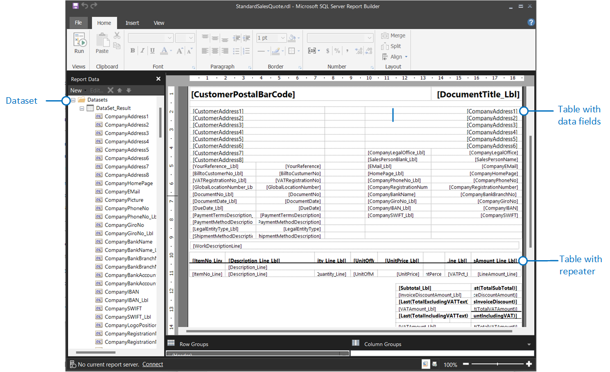

# Working with RDLC Layouts

RDLC layouts are based on report definition layout files (.rdl or .rdlc file types). The design concepts for RDLC layouts are similar to other layout types. The layout determines what fields to show and how they're arranged. However, designing RDLC layouts is more advanced than Word and Excel layouts.

## Required tools

To modify RDL layouts, you can use either Microsoft SQL Server Report Builder or Microsoft Visual Studio with the RDLC Report Designer extension.

- Report Builder is a stand-alone app installed on your computer by you or an administrator. With Business Central on-premises, Report Builder is automatically installed with the Business Central Server installation. For more information about installing Report Builder, see [Install Report Builder](/sql/reporting-services/install-windows/install-report-builder) in the SQL Server documentation.

- RDLC Report Designer is an extension for Visual Studio 2019 and later. You can download and install RDLC Report Designer from the [Visual Studio Marketplace](https://marketplace.visualstudio.com/items?itemName=ProBITools.MicrosoftRdlcReportDesignerforVisualStudio-18001).

## Create and modify RDLC layouts

Creating and modifying RDLC layouts is an advanced task, which is typically done by power users or developers. The basic concepts aren't specific to Business Central report layouts. For this reason, we refer you to the following documentation:

- [Create RDL Layout Report](/dynamics365/business-central/dev-itpro/developer/devenv-howto-rdl-report-layout)

   This article explains how to create an RDLC report layout from AL code.

- [Reports, Report Parts, and Report Definitions](/sql/reporting-services/report-design/reports-report-parts-and-report-definitions-report-builder-and-ssrs?)

   This links you to the SQL Server Reporting Services documentation for RDL/RDLC. This article explains the concepts behind RDL/RDLC and how to use Report Builder.

> [!NOTE]
> Report Builder only recognizes the .rdl file type, not .rdlc. Layout files exported from Business Central are .rdlc file types. So to modify these layout in Report Builder, rename the file type to .rdl.

## Related information

[Managing Report Layouts](ui-manage-report-layouts.md)  
[Set the Layout Used by a Report](ui-set-report-layout.md)  
[Get Started Creating Report Layouts](ui-get-started-layouts.md)  
[Working with Reports, Batch Jobs, and XMLports](ui-work-report.md)  
[Business Intelligence](bi.md)  
[Working with [!INCLUDE[prod_short](includes/prod_short.md)]](ui-work-product.md)  
[Analyzing Report Data with Excel](report-analyze-excel.md).

[!INCLUDE[footer-include](includes/footer-banner.md)]
