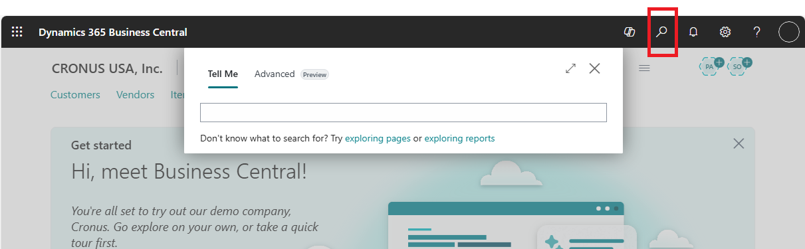

# Finding pages and information with Tell Me

This article describes how the in-product search called *Tell me what you want to do*, or Tell Me for short, can help you: 

* Quickly go to things like actions, pages, or reports.
* Search for specific data, either on a list page or in all of [!INCLUDE [prod_short](includes/prod_short.md)].
* Find [!INCLUDE [prod_short](includes/prod_short.md)] documentation about a subject you're interested in.

<!-- ![!VIDEO https://go.microsoft.com/fwlink/?linkid=2086048] -->

## Get started with Tell Me
<!--
Tell Me feature — quick usage guide

How it works
- The Tell Me feature has two tabs: "Tell Me" and "Advanced".
- Both tabs search the same items, but use different methods:
  - Tell Me: finds matches based on the exact words or keywords you type.
  - Advanced: uses AI (semantic search) to find results based on the meaning of your query.

How to use
1. Open Tell Me and select the tab you want: Tell Me or Advanced.
2. Type your search as plain, everyday language — short phrases or full sentences both work.
3. Press Enter or pick a result from the suggestions to go directly to the command, page, or report.

When to use which tab
- Use Tell Me when you know specific words or exact command names.
- Use Advanced when you only know what you want to achieve but not the exact name. The AI interprets intent and returns relevant items even without exact matches.

Example
- Query: "report that shows my best customers"
- Result (Advanced): finds the Customer - Top 10 report even if you don't know that exact report name.

Tips
- Be descriptive: include what you want to do (e.g., "create invoice for customer"), not just a single keyword.
- Try the Advanced tab if Tell Me doesn't return useful results — semantic search will broaden the matches.
-->

When you need help with finding something, [!INCLUDE[open-search](includes/open-search-lowercase.md)] to open the **Tell Me** feature.

The Tell Me feature has two tabs, depending on your setup: **Tell Me** and **Advanced**. Both tabs search the same items based on text you enter, but use different methods:

# [Tell Me](#tab/tellme)

The **Tell Me** tab is always available. It has the name **Tell me what you want to do** if the **Advanced** tab is missing. Tell Me finds matches based on the exact letters, words, or phrases you type. When you start typing characters, [!INCLUDE[prod_short](includes/prod_short.md)] immediately displays matches. Results in the list change as you type more characters. The search uses synonyms and alternate search terms to make it easier to find actions, pages, and reports. For example, if you enter the word *product*, the results include *items*. 

The **exploring pages and reports** action opens a feature overview that shows all available features for your role or for all roles. Learn more at [Finding Pages with the Role Explorer](ui-role-explorer.md).

# [Advanced (preview)](#tab/advanced)

[!INCLUDE [preview-banner](~/../shared-content/shared/preview-includes/preview-banner-section.md)]

**Advanced** uses AI (semantic search) to find results by the meaning of your search text, not exact words. Type what you are looking for in plain, everyday language&mdash;short descriptive phrases or full sentences&mdash;and select **Search** :::image type="icon" source="media\ui-search\tell-me-advanced-search-icon.png" ::: in the box or <kbd>Enter</kbd> to run the search.

The Advanced tab is useful even if you don’t know the names of things you're looking for. For example, type a phrase like "report that shows my best customers" to find the Customer - Top 10 report.

The **exploring pages and reports** action opens a feature overview that shows all available features for your role or for all roles. Learn more at [Finding Pages with the Role Explorer](ui-role-explorer.md).

> [!IMPORTANT]
> - This feature is a production-ready preview feature.
> - Production-ready previews are subject to [supplemental terms of use](https://go.microsoft.com/fwlink/?linkid=2189520).
> - This feature is available in Business Central online only, not on-premises, and only when an admin enables **Feature: Advanced Tell Me (preview)** in the **Feature Management** page. Learn more in [Feature Management](/dynamics365/business-central/dev-itpro/administration/feature-management).

---

Search results display on the page the same way for the **Tell Me** or **Advanced** tab.

The rigt-side column indicates the general category of the result. For example, whether it opens a list page or is an administrative task. The page categorizes results based on the data that you enter and the page you're working on. The following sections describe the categories.

> [!TIP]  
> If you prefer to use your keyboard, use the <kbd>Tab</kbd> key and <kbd>Arrow</kbd> keys to choose an item in the results. If you select the <kbd>Enter</kbd> key on your keyboard without choosing a result, [!INCLUDE[prod_short](includes/prod_short.md)] opens the result that is listed first.

## Find an action on the current page

The **On current page** section lets you find actions on the page you have open. For example, if the **Sales Quote** page is open and you type "customer," the section includes an action that opens the Customer Card page for the customer chosen on the sales quote.

> [!NOTE]  
> The list includes only actions that are available on the navigation bar at the top of the page. Actions on FastTabs aren't included.  

## Find a page or a task

The results in the **Go to Pages and Tasks** section provide access to other pages and let you perform tasks or look up information. If you use these pages often, you can choose the bookmark icon to add a link to any page onto your Role Center. Learn more in [Add a Page Action to Your Role Center](ui-bookmarks.md).

The pages and tasks that are listed depend on the user experience you chose for your company. The **Essentials** experience gives access to fewer pages and tasks than the **Premium** experience does. The first time you sign in, you use the **Essentials** experience. Learn more about user experiences in [Customizing Your [!INCLUDE[prod_short](includes/prod_short.md)] Experience](ui-experiences.md).

## Find a report or archived information

The **Go to Reports and Analysis** section offers access to reporting tools. For example, you can open the **Balance Sheet** report from the list, or access archived documents and other information.  

## Find a record or search the documentation

Use Tell Me feature to search for data across [!INCLUDE [prod_short](includes/prod_short.md)]. For example, you can find a customer by entering their name or address, or even find a specific record, such as a sales order. You can also use it to find information in our documentation.

The **Search for \<keyword\>** section offers a couple of ways to search:

* Use the **Search company data** action to search all pages in [!INCLUDE [prod_short](includes/prod_short.md)]. Learn more about how the company data search works in [Search for a record in company data](ui-search-data.md).
* Use the **Search Help** action to find an article in the Business Central documentation that contains your keyword.

Just enter at least three characters of a keyword, and then choose either **Search company data** or **Search Help**.

* If you search for data, results display on the **Search in company data** page, where they're sorted by type.  
* If you search in our Help, the **Help** pane offers links to articles that contain your keywords. You also get a snippet from the article that can help you decide whether it's what you're interested in.

> [!NOTE]
> - Your search results don't include documentation for Non-Microsoft extensions.
> - Searching all data in [!INCLUDE [prod_short](includes/prod_short.md)] might take time. To speed up results, use the **Show tables to search** action to choose the tables and fields that you want to include in your searches. The tables and fields that you can choose from vary, depending on your Role Center. By default, all tables and fields are chosen, which can slow down the search. We recommend that you exclude as many tables and fields as you can.

[!INCLUDE [ui-how-search-works](includes/ui-how-search-works.md)]

## Get more functionality from apps

Our partner community is busily developing apps that add capabilities to [!INCLUDE[prod_short](includes/prod_short.md)]. The **Get from Microsoft AppSource** section lists apps for [!INCLUDE[prod_short](includes/prod_short.md)] that are available on Microsoft AppSource and are related to the keyword you searched for.

## Use search on list pages

It isn't related to Tell me what you want to do, but there's another way to search for specific data. When you're using a list page, you can use the  **Search** field in the left corner of list page headers to search for data on the page. The search applies only to the list you're viewing. Learn more about working with data on list pages in [Sorting, Searching, and Filtering Lists](ui-enter-criteria-filters.md#searching).  

> [!TIP]
> You can search for posted document lines, such as invoice lines, credit memo lines, shipment lines, and receipt lines. Search for the type of document lines that you want to find, and then bookmark the links to the documents on your home page for easy access to the original or a filtered view. Learn more in [Add a Page Action to Your Role Center](ui-bookmarks.md).

## Questions?

We've shown search to a range of stakeholders, noted the questions that they had in common, and turned our notes into a list of frequently asked questions. If you're interested, go to [Tell Me FAQ](ui-search-faq.md).

## Related information

[Work with Business Central](ui-work-product.md)  
[Add a Page Action to Your Role Center](ui-bookmarks.md)  
[Save and Personalize List Views](ui-views.md)  

[!INCLUDE[footer-include](includes/footer-banner.md)]
