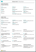

# Working with [!INCLUDE[d365fin](includes/d365fin_md.md)]
When performing business tasks, you interact with data in different ways, such as creating records and entering data, sorting and filtering data, writing notes, and outputting data to other applications.

For example, you can adjust the size and position of any page, expand the width of columns and increase the height of column headers, and change the sorting of data in columns. And if you want to use the horizontal scroll bar to view all columns on a list page or on document lines, you will see that there is a vertical freeze pane to restrict some columns from scrolling.

## Tips and Tricks

> [!TIP]
> For a print-friendly overview of the most used functions, choose the following image and download the PDF file.
>
> 

## Links to Learn More

The following table lists some of the general functionality with links to topics that describe them.

> [!NOTE]
> In addition to the general UI functions described in this section, you can use other general functions that are more business-related. For more information, see [General Business Functionality](ui-across-business-areas.md).

| To  | See |
| --- | --- |
|Find a specific page, report, action, help topic, or partner extension. |[Finding Pages and Information with Tell Me](ui-search.md) |
|Get an overview of pages for your role and for other roles and navigate to pages.|[Finding Pages with the Role Explorer](ui-role-explorer.md)|
| Filter data in views, reports, or functions by using special symbols and characters. |[Sorting, Searching, and Filtering Lists](ui-enter-criteria-filters.md) |
|Learn the many general functions that help you enter data in a quick and easy way.|[Entering Data](ui-enter-data.md)|
|Learn how to quickly copy and paste data including by using keyboard shortcuts.|[Copying and Pasting FAQ](ui-copy-paste.md)|
| View or process data in specific date ranges. |[Working with Calendar Dates and Times](ui-enter-date-ranges.md) |
| See which fields must be filled in. |[Detecting Mandatory Fields](ui-mandatory-fields.md) |
|Understand how the computer locale affects the user interface and the Help site and how to change the language.|[Changing Language and Locale](about-locale-language.md)|
|Learn how to interact with Excel from practically anywhere in [!INCLUDE[d365fin](includes/d365fin_md.md)]|[Viewing and Editing in Excel](across-work-with-excel.md)|
|Attach files, add links, or write notes on cards and documents.|[Manage Attachments, Links, and Notes on Cards and Documents](ui-how-add-link-to-record.md)|
| Change basic settings such as company, work date, and Role Center. |[Change Basic Settings](ui-change-basic-settings.md) |
|Get notified about certain events or changes in status, such as when you are about to invoice a customer who has an overdue balance.|[Manage Notifications](ui-smart-notifications.md)|
| Change which and where UI elements are shown to fit your preferences.|[Personalize Your Workspace](ui-personalization-user.md) |
|Define, preview, print, or save reports and define and run batch jobs.|[Working with Reports, Batch Jobs, and XMLports](ui-work-report.md)|
| Manage the content and format of reports and documents, including which data fields of a report dataset appear on the report and how they are arranged, text style, images, and more.|[Managing Report and Document Layouts](ui-manage-report-layouts.md) |
|Learn about features and capabilities that make [!INCLUDE[d365fin](includes/d365fin_md.md)] readily available to people with disabilities.|[Accessibility and Keyboard Shortcuts](ui-accessibility.md)|

## Getting Around in Business Central
Here's a short video about how to get around in [!INCLUDE[d365fin](includes/d365fin_md.md)].

> [!VIDEO https://www.youtube.com/embed/zqz03iMihx0]

## Choosing a desktop browser

[!INCLUDE[prodshort](includes/prodshort.md)] supports multiple browsers that each offer a variety of features and capabilities. The browser plays a significant role in the responsiveness and fluidity of the user interface. See the list of supported, recommended browsers for [Business Central online](https://go.microsoft.com/fwlink/?linkid=2110804) and browsers for [Business Central on-premises](https://go.microsoft.com/fwlink/?linkid=2110719).

- Where possible, avoid older browsers such as Internet Explorer, and switch to one of our recommended modern browsers, such as the [new Microsoft Edge](https://www.microsoft.com/edge/).  

    Internet Explorer is still supported, but since the new Edge browser is available for Windows Server now, we see a declining rate of usage for Internet Explorer. You can also get [a pilot of Edge in IE mode](https://www.microsoft.com/edge/business). For more information, see [Microsoft Edge documentation](https://support.microsoft.com/hub/4337664/microsoft-edge-help).
- Keep your browser always updated to the latest version.

## See Related Training at [Microsoft Learn](/learn/paths/work-pro-data-dynamics-365-business-central/)

## See Also

[Getting Started](product-get-started.md)  
[Setting Up Business Central](setup.md)  
[General Business Functionality](ui-across-business-areas.md)  
[Performance Tips for Business Users](/dynamics365/business-central/dev-itpro/performance/performance-users?toc=/dynamics365/business-central/toc.json)

## [!INCLUDE[d365fin](includes/free_trial_md.md)]
