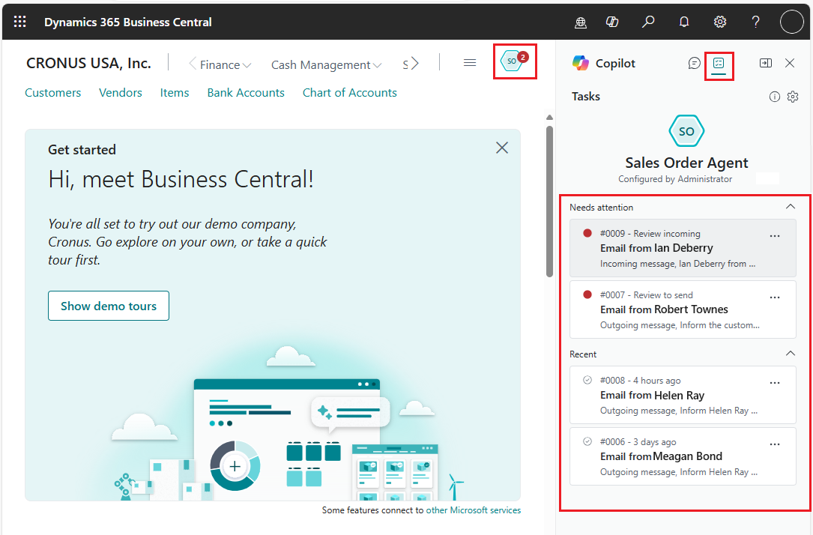
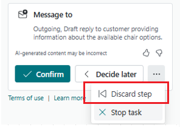
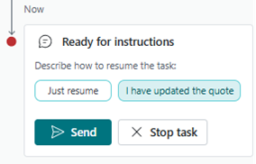

# Use Payables Agent (preview)

[!INCLUDE [preview-banner](~/../shared-content/shared/preview-includes/preview-banner.md)]

This article explains how to use Payables Agent to help you process vendor invoices received via email. The Payables Agent uses  AI to analyze incoming invoices, create drafts for review, and reduce manual corrections.

The agent monitors a designated mailbox for incoming email from vendors or employees with attached PDF invoices. about item inquiries. When it identifies a potential request, it starts converting the request into an order. For example, it verifies the customer, checks item availability, creates a sales quote, and prepares an email response to the customer with the quote as a PDF attachment.

Some steps require your intervention, such as reviewing email correspondence and assisting the agent as needed. Until an order is created, the agent handles email exchanges with the customer to resolve any missing details and allow for modifications to the original request if necessary.

Learn more about the Payables Agent and its process flow in .

[!INCLUDE [preview-note](~/../shared-content/shared/preview-includes/production-ready-preview-dynamics365.md)]
<!--[!INCLUDE [limited-public-preview](includes/limited-public-preview.md)]-->

## Supported languages

[!INCLUDE[soa-language-support](includes/soa-language-support.md)]

## Prerequisites

Sales Order Agent is activated, and you have permission to use it. Learn more in [Set up Sales Order Agent](sales-order-agent-setup.md).

## Get started

You collaborate with Payables Agent to process invoices using the **Tasks** tab in the **Copilot** pane.

To access this view, select  **Payable Agent** on the upper right of the navigation menu. A red circle with a number on the icon indicates the tasks that need attention.

The  **Tasks** tab opens in the **Copilot** pane to display tasks recently created by the agent. Tasks that require attention&mdash;like reviewing an incoming or outgoing email&mdash;are at the top of the list.  

For each sales quote request, Sales Order Agent adds a task to track, review, and follow up on updates, eventually processing the quote into an order. Tasks can consist of multiple steps that form a timeline of the process.

> [!TIP]
> Hover over the  **Payable Agent** icon in the role or select the  **Show summary for Payables Agent** in the **Task** tab to get an overview of the agent's key performance indicators (KPIs) summarizing the impact of the agent's work in your organization. For example, view the number of sales quotes or orders created by the agent, the time saved by your team, and the total number of sales orders created.

## Review and assist

While the agent does the bulk of work autonomously, it asks for user intervention when required for various steps to move through the process, such as:

- Review and confirm the vendor.
- Review and confirm the generated invoice document.
- Providing assistance to the agent when it needs to get unblocked—for example, to provide missing data.

Steps requiring intervention are listed under **Needs Attention** in the **Tasks** tab. To review a step:

1. In the **Task** tab, select the step requesting review or assistance.

   The task *timeline* opens, focused on the selected step. The timeline displays each step of a task, past and present, in chronological order.

1. Select **Review** for the step.

   The **Tasks** tab switches to **Review** mode, and the Agent Task Message window opens to display the email contents or quote or order, depending on the task.

1. Review the contents and make changes as needed.

1. When you're satisfied with the content and want the process to continue, select **Confirm** in the **Review** pane. If you want to complete the task yourself, select **Stop** to halt the agent's processing of this task.

After confirmation, the agent continues processing the task. When a new notification appears on the Payables Agent icon after some time, follow the same flow to review  and confirm the results.

## Modify sales quotes and orders

You might need to modify sales quotes or orders created by the agent during a review step or when the agent requests assistance, based on its configuration. When you select **Review**, the quote or order opens for inspection. Make changes as needed, then select **Confirm** in the **Review** pane. The agent processes the document, creating a PDF for the outgoing email to the customer.

You also have the opportunity to modify a quote or order during the review step for an outgoing email. In this case, select **...** (More options) > **Discard step** on the step. This action stops the task temporarily to allow you to open the quote or order and makes changes and then resume the step.

> [!NOTE]
> **Discard step** is available only on review steps for outgoing emails.

After you make the changes, return to the **Tasks** tab, select one of the following options for resuming the task, and then select **Send**:

- **I have updated the quote** or **I have updated the order**: Select one of these options if you made changes to the quote or order. The agent generates a new PDF and email for the customer.
- **Just resume**: Select this option if you didn't change the quote or order. The agent doesn't generate a new quote or order and keeps the original email as before.  

If you change your mind while reviewing the outgoing message and decide to make more changes to the sales document, use the **Discard step** action to discard the email message generated by the agent. Then, update the sales document as needed and instruct the agent to create a new outgoing email with the updated attachment.

## Assist with item availability

Depending on the agent's setup, it can check item availability in the requested quantity before adding them to a quote or order. You can't change the items and quantities at this point, but you can review and confirm the step so the agent creates a reply email to the customer.

<!--
1. Select **Review** to open the **Items availability** page.
1. Use the page to verify that the item isn't available in the requested quantity.
1. Select **Confirm**.

   The agent creates the reply email for review.-->

Learn more in [Item availability in Sales Order Agent (preview)](sales-order-agent-item-availability.md).

## Stop a task

Most steps of a task include a **Stop** button that lets you terminate the process. When you select **Stop**, a task isn't terminated immediately—you're asked to confirm before the task is stopped.

Before you stop a task, consider the following behavior:

- Stopped tasks can't be restarted.
- Stopping the task might leave some results incomplete or unwanted, and it might require follow-up actions with the customers. Follow up actions depend on where in the process the task was stopped.

  For example, suppose you stopped a task after a sales quote was created. Although the process stopped, the sales quote is still stored in the system as open. You might have to manually edit the state depending on your company policy and then update the customer.
- Stopped tasks aren't deleted immediately. You can still explore a task's timeline until it's deleted, typically by an administrator.

<!--
## Discard and resume a task to modify a quote or order

The **Discard**  action ellwo

## View timeline and details of steps

From the  **Tasks** view, you can view the details of each step of a task in chronological order. Click on the task or select **...** (More options) > **Show Details**.-->

## Scenarios impacting reliability in handling customer requests

- You might need to correct the quantities in the created document when non-base units of measurement differ from the standard ones.  

  For example, if the system treats 1 kilogram as 900 grams and a customer requests 2 kilograms, the system might generate a document showing 2,000 grams instead of 1,800 grams or 2 kilograms.

- Reliability decreases if you significantly change the email the agent drafts about item availability before sending it to the customer.

  This issue is more apparent when the external customer follows up with an email using pronouns like "them" or "it" and other words instead of repeating specific quantities and names. For example, the customer replies, "I want them all."

- The agent searches for items using item attributes, but the attributes aren't shown to the agent on the item availability page. This condition decreases reliability for customer requests that depend specifically on the attributes.

  Consider the following example:

  1. Items in the database:
  
     `[{no: ITEM-1, description: Shirt, attributes: Linen}, {no: ITEM-2, description: Shirt, attributes: Cotton}]`

  2. Customer's initial request email:

     `I want a quote for nice shirts`

  3. Agent's reply email:
  
     `We have X quantity of ITEM-1 Shirt and ITEM-2 Shirt`

  4. Customer's response email:
  
     `I want the ones with linen material`

## Related information

[Sales Order Agent overview](sales-order-agent.md)  
[Set up Sales Order Agent](sales-order-agent-setup.md)  
[FAQ for Sales Order Agent](faqs-sales-order-taker-agent.md)  
[Configure Copilot and agent capabilities](enable-ai.md)  
