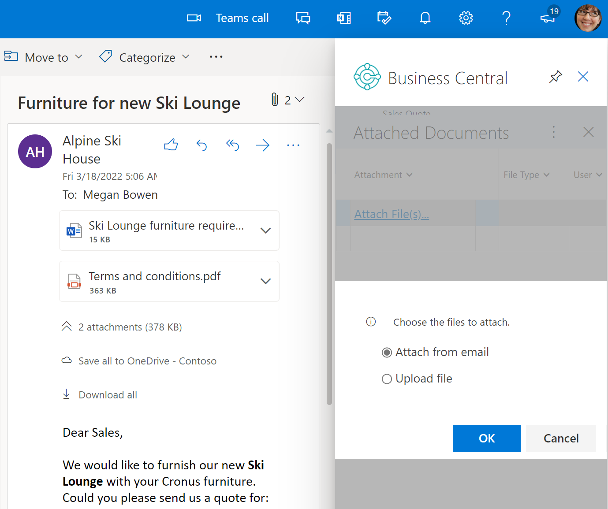

# Welcome to Microsoft Dynamics 365 Business Central

[!INCLUDE[prod_short](includes/prod_short.md)] is a business management solution for small and mid-sized organizations that automates and streamlines business processes and helps you manage your business. Highly adaptable and rich with features, [!INCLUDE[prod_short](includes/prod_short.md)] enables companies to manage their business, including finance, manufacturing, sales, shipping, project management, services, and more. Companies can easily add functionality that is relevant to the region of operation, and that is customized to support even highly specialized industries. [!INCLUDE[prod_short](includes/prod_short.md)] is fast to implement, easy to configure, and simplicity guides innovations in product design, development, implementation, and usability.  

If you already have [!INCLUDE[prod_short](includes/prod_short.md)], sign in at [https://businesscentral.dynamics.com](https://businesscentral.dynamics.com). Otherwise, [get the overview](https://dynamics.microsoft.com/business-central/overview/), [take the guided tour](https://dynamics.microsoft.com/guidedtour/dynamics/business-central/1/1), and then [learn how to start a free trial](trial-signup.md). Check out the [quickstart articles](quick-start-business-central.md) to help you get to know [!INCLUDE [prod_short](includes/prod_short.md)]. To learn more about onboarding to [!INCLUDE[prod_short](includes/prod_short.md)], go to [Get Ready for Doing Business](ui-get-ready-business.md).  

## Core business functionality

[!INCLUDE[prod_short](includes/prod_short.md)] provides features for typical business processes, mainly within wholesale and professional services. However, it also supports more complex processes, such as assembly, manufacturing, service, and directed warehouse management. Standard configurations for most business processes are built in, but you can customize them to suit your business needs.

Maybe start with a short tour of some of the key capabilities for managing finances.     

> [!Video https://learn-video.azurefd.net/vod/player?id=2887ddfe-3d46-47b3-8308-9715457ef939]

| To... | Learn more here... |
| ----- | ------------------ |
|Make and collect payments, manage your cash flow, defer income and revenue, prepare year-end closing, and manage fixed assets.|[Finance](finance.md)|
|Manage sales processes and information, such as quotes, orders, returns, and customer accounts, and make drop shipments.|[Sales](sales-manage-sales.md)|
|Manage purchasing processes and information, such as invoices, orders, returns, and vendor accounts, and purchase items from sales documents. |[Purchasing](purchasing-manage-purchasing.md)|
|Register new inventory or service-type items, categorize items so they're easy to search for, adjust inventory levels, and track inventory costs.|[Inventory](inventory-manage-inventory.md)|
|Create projects and schedule resources for them, manage project budgets, monitor progress, and track machine and employee hours.|[Project Management](projects-manage-projects.md)|
|Organize your fixed assets, ensure correct periodic depreciation, and track maintenance costs.|[Fixed Assets](fa-manage.md)|
|Plan the production operations required to turn components into finished goods.|[Planning](production-planning.md)|
|Assemble components into finished items, or combine them in kits.|[Assembly Management](assembly-assemble-items.md)|
|Define shop floor resources and their capacity, schedule operations, pull production components, and manage production operations.|[Manufacturing](production-manage-manufacturing.md)|
|Ensure that you receive, store, transfer, and ship goods effectively.|[Warehouse Management Overview](design-details-warehouse-management.md)|
|Schedule service calls, manage service orders, and track repair parts and supplies.|[Service Management](service-service.md)|

To learn more, go to [Business functionality supported by Business Central](across-business-functionality.md).

## Copilot and agents

With Copilot in [!INCLUDE [prod_short](includes/prod_short.md)], small and medium-sized organizations empower their employees through intuitive AI tools that boost creativity and save time.

| To... | Learn more here... |
| ----- | ------------------ |
| Calculate, summarize, and analyze data by expressing what you want in natural language. For example, "sort on quantity from smallest to largest" or "show average cost per category." | [Analyze data in lists with Analysis Assist Copilot](analysis-assist.md) |
| Autofill fields in your documents and records using AI-powered suggestions. | [Autofill with Copilot](autofill-fields-with-copilot.md)  |
| Help you reconcile bank accounts | [Reconcile bank accounts with Copilot](bank-reconciliation-with-copilot.md) |
| Get answers about your company data and to get assistance with tasks and subject matters related to [!INCLUDE [prod_short](includes/prod_short.md)]. | [Chat with Copilot](chat-with-copilot.md) |
| Automate how you receive and process vendor invoices. | [Map e-documents to purchase order lines with Copilot](map-edocuments-with-copilot.md) |
| Get assistance with authoring marketing text (product descriptions) for the items you sell in your online shops. | [Marketing text suggestions with Copilot](ai-overview.md) |
| Create sales documents faster by letting Copilot suggest items to add to lines on sales documents. | [Suggest lines on sales documents with Copilot](sales-suggest-sales-lines-with-copilot.md) |
| Automate the process of creating sales orders. | [Sales Order Agent](sales-order-agent.md) |
| Get suggestions for lines to add on sales orders with Copilot. | [Suggest lines on sales orders with Copilot](sales-suggest-sales-lines-with-copilot.md) |
| Get suggestions for number series to use in your documents. | [Suggest number series with Copilot](suggest-number-series-copilot.md) |
| Find and assign substitute items faster. | [Suggest substitute items with Copilot](suggest-item-substitutions-copilot.md) |
| Summarize data and content in your records using Copilot. | [Summarize with Copilot](summarize-with-copilot.md) |

To learn more, go to [About Copilot in Business Central](copilot-overview.md).
 
## Analytics

Empower any role in your organization with the insights they need to make decisions based on data. Use financial reporting and KPIs in your leadership team, create overview reports for middle management, and operational reports for staff. Group and pivot data from any list to do ad-hoc analyses. Export and analyze your data in Excel, if that app is your tool of choice. Each area in the application comes with standard, easy to use tools for data analysis.

:::image type="content" source="media/finance/financial-overview.png" alt-text="Screenshot of the Finance Overview report" lightbox="media/finance/financial-overview.png":::

| To... | Learn more here... |
| ----- | ------------------ |
| Set up financial reports to analyze figures in general ledger (G/L) accounts, and compare general ledger entries with budget entries. | [Using Financial reporting to produce financial statements and KPIs](bi.md) |
| Analyze your business KPIs with built-in [!INCLUDE [power-bi-name](includes/powerbi-name.md)] reports | [Power BI apps/reports by functional area](across-powerbi-apps-by-functional-area.md) |
| Analyze (group, filter, and pivot) data directly in [!INCLUDE[prod_short](includes/prod_short.md)] | [Perform ad-hoc data analysis](reports-adhoc-analysis.md) |
| Get an overview of built-in reports in [!INCLUDE[prod_short](includes/prod_short.md)] | [Report overview](reports-available-reports.md) |

To learn more, go to [Analytics overview](reports-bi-reporting.md).

## Connect to other Microsoft apps

Empower people to be more collaborative, productive, and impactful with the power of collaborative applications. When [!INCLUDE [prod_short](includes/prod_short.md)] and other Microsoft apps work together, small and medium-sized businesses can boost productivity and redefine how they get work done. With data delivered directly to familiar Microsoft Office apps such as Outlook, Excel, and collaborative tools such as Microsoft Teams, you get the information you need without switching between applications.

| To... | Learn more here... |
| ----- | ------------------ |
| Connect Teams to [!INCLUDE[prod_short](includes/prod_short.md)] and efficiently share and interact with real-time data, transforming Teams into a centralized hub for all your daily operations. | [Sharing Business Central records and page links in Microsoft Teams](across-working-with-teams.md) |
| Connect real-time data from [!INCLUDE[prod_short](includes/prod_short.md)] to Outlook. Save time with visibility into customer and vendor information such as sales, purchase details, and more without leaving your inbox. | [Use Business Central as your Business Inbox in Outlook](work-outlook-addin.md) |
| Export any [!INCLUDE[prod_short](includes/prod_short.md)] data to Excel. Save time by bulk updating records in Excel and uploading the revised records to [!INCLUDE[prod_short](includes/prod_short.md)]. Get timely operational insights from [!INCLUDE[prod_short](includes/prod_short.md)] as Excel reports. | [View and edit in Excel from Business Central](across-work-with-excel.md) |

<!-- 
TODO: need a landing page for Microsoft 365 integrations 
-->

## Connect to Power Platform

Integrating [!INCLUDE[prod_short](includes/prod_short.md)] with the Microsoft Power Platform offers a solution that enhances business productivity and efficiency. It provides a set of tools that enable you to analyze data, build solutions, automate processes, and create virtual agents.

:::image type="content" source="media/power-automate-menu.svg" alt-text="Shows the Automate action in the action bar with expanded actions.":::

| To... | Learn more here... |
| ----- | ------------------ |
| Set up and use Power Automate workflows to connect the business tasks that different users do. | [Use Power Automate flows in Business Central](across-how-use-financials-data-source-flow.md) |
| Get insights into your [!INCLUDE[prod_short](includes/prod_short.md)] data with Power BI and create custom visualizations and reports. | [Work with Power BI reports in Business Central](across-working-with-powerbi.md) |
| Build Power App solutions for your business domain with [!INCLUDE[prod_short](includes/prod_short.md)] data and processes | [Connecting to Your Business Central Data to Build a Business App Using Power Apps](across-how-use-financials-data-source-powerapps.md) |

<!-- 
TODO: need a landing page for Power Platform integrations 
-->

## Get help inside [!INCLUDE [prod_short](includes/prod_short.md)]

Did you get to this article from inside [!INCLUDE [prod_short](includes/prod_short.md)]? If you aren't sure where to find what you're looking for, you can **Filter by title** in the table of contents to the left, or you can use the **Search** field at the top of the browser window.  

You can also use the search capabilities in [!INCLUDE [prod_short](includes/prod_short.md)] to find relevant documentation. To learn more, go to [Finding Pages and Information with Tell Me](ui-search.md).

[!INCLUDE [ua-get-help](includes/ua-get-help.md)]

## Microsoft Learn

In the table of contents to the left, you can find information about using [!INCLUDE[prod_short](includes/prod_short.md)] in your company. Also, check out the [Learn more using the product documentation](product-help-and-support.md#learn-more-using-the-product-documentation) section.

You can dive into online guided training paths at your own pace at [Microsoft Learn](/training/dynamics365/business-central?WT.mc_id=dyn365bc_landingpage-docs). The learning paths and modules can help you build the skills you need to help you earn credentials. To learn more, go to [Get started with Microsoft Dynamics 365 Business Central](/training/paths/get-started-dynamics-365-business-central/).

If you prefer watching content rather than read it, then [visit our video library](across-videos.md).

> [!NOTE]
> Unless otherwise specified, articles on Microsoft Learn reflect the latest version of [!INCLUDE[prod_short](includes/prod_short.md)] online. If your organization uses a different version of [!INCLUDE[prod_short](includes/prod_short.md)] online, some capabilities might not yet be available. Also, if your organization uses [!INCLUDE[prod_short](includes/prod_short.md)] on-premises, you might be using an earlier version. To learn more, go to [Frequently Asked Questions](across-faq.yml).

## Related information

[Explore Dynamics 365 Business Central capabilities](https://www.microsoft.com/dynamics-365/products/business-central#Features)  
[Business Central quickstarts](quick-start-business-central.md)  
[Getting Started with Business Central](ui-get-ready-business.md)  
[Dynamics 365 Business Central training](/training/dynamics365/business-central?WT.mc_id=dyn365bc_landingpage-docs)  
[Resources for Help and Support](product-help-and-support.md)  
[Learn more using the product documentation](product-help-and-support.md#learn-more-using-the-product-documentation)  
[What's new and changed](/dynamics365/business-central/dev-itpro/whatsnew/overview)  
[Major Updates and Minor Updates of Business Central Online](/dynamics365/business-central/dev-itpro/administration/update-rollout-timeline)  
[Dynamics 365 Business Central on microsoft.com](https://www.microsoft.com/dynamics-365/products/business-central/)  
[[!INCLUDE[prod_short](includes/prod_short.md)] Compliance](compliance/compliance-overview.md)  
[[!INCLUDE[prod_short](includes/prod_short.md)] Online Service Terms](compliance/compliance-service-compliance.md#service-terms)  

## [!INCLUDE[prod_short](includes/free_trial_md.md)]

[!INCLUDE[footer-include](includes/footer-banner.md)]
