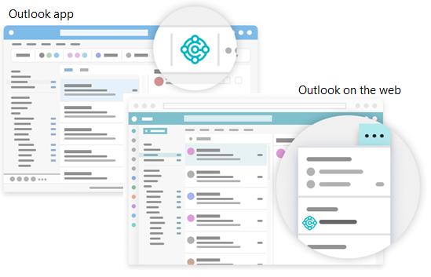

# Use Business Central as your Business Inbox in Outlook

[!INCLUDE[prod_short](includes/prod_short.md)] offers an add-in that lets you manage business interactions with your customers and vendors, directly in Microsoft Outlook. With the [!INCLUDE[prod_short](includes/prod_short.md)] add-in for Outlook, you can see financial data related to customers and vendors, and create and send financial documents, such as quotes and invoices.

[!INCLUDE[prod_short](includes/prod_short.md)] add-in consists of two separate add-ins that provide the following capabilities:

- Contact insights

   This add-in lets you look up [!INCLUDE[prod_short](includes/prod_short.md)] customer or vendor information in Outlook emails and calendar appointments. It also lets you create and send [!INCLUDE[prod_short](includes/prod_short.md)] business documents, such a sales quote or invoice to a contact.

- Document view

   When a business document is sent in an email, the add-in provides a direct link from email to the actual business document in [!INCLUDE[prod_short](includes/prod_short.md)].

## Get started

1. The first thing to do is get the [!INCLUDE[prod_short](includes/prod_short.md)] add-in installed in Outlook. Your administrator may have already installed the add-in for you. So if you're not sure, check with your administrator or see the next step to verify whether it's installed.

    If the add-in hasn't been installed for you, see [Install the add-in for your own use](admin-outlook.md#install). 

2. With the add-in installed, you can access the **[!INCLUDE[prod_short](includes/prod_short.md)]** add-in from any new or existing email message or calendar appointment in Outlook.

    Start by signing in to Outlook and opening an email message. Then, if you're using the Outlook app, go to the ribbon, and look for **[!INCLUDE[prod_short](includes/prod_short.md)]**.  Or if you're using Outlook on the web, at the top the email message, select **Apps**  > **Business Central**  or go to the more actions  button.

    

   If you've installed the add-in on your own and chose to get a sample email, check your inbox for the welcome email. This email provides information to help you get started.

The first time you use the add-in, in [!INCLUDE[prod_short](includes/prod_short.md)] add-in pane, you might be asked to sign in. In this case, choose **Sign in now** and follow the instructions onscreen to sign in to Business Central using your account.

> [!TIP]
> If you use the new Outlook on the web, you can pin **[!INCLUDE[prod_short](includes/prod_short.md)]** so that it is always immediately visible, instead of having to go to the more actions button, making it convenient to view contact insights while you browse through different emails.

For more information, see [Use add-ins in Outlook on the web](https://support.office.com/article/using-add-ins-in-outlook-on-the-web-8f2ce816-5df4-44a5-958c-f7f9d6dabdce?ns=OLWAO365B&version=16).  

## Work with contacts and documents using the Contact Insights add-in

Let's say that you get an email from a customer that wants to get a quote on some items. Directly in Outlook, you open the [!INCLUDE[prod_short](includes/prod_short.md)] add-in, which recognizes the sender as a customer, and opens the customer card for that company. From this dashboard, you see overview information for the customer, and drill down for more detail on specific documents. You can also dig into the sales history for the customer. If it's a new contact, you can create them as a new customer in [!INCLUDE[prod_short](includes/prod_short.md)] without leaving Outlook.  

In the add-in, you can create a sales quote and send it back to this customer without leaving Outlook. All of the information that you need to send the sales quote is available in your business inbox in Outlook. Once you have the data entered, you post the quote and send it by email. [!INCLUDE[prod_short](includes/prod_short.md)] generates a .PDF file with the sales quote and attaches it to the email message that you draft in the add-in.  

Similarly, if you get an email from a vendor, you can use the add-in to work with vendors and purchase invoices.  

Sometimes you want to see more fields than you can see in the add-in, such as when you want to fill in lines in an invoice. To give you a bit more space to work with, you can pop out the add-in to a separate page. It's still part of Outlook, but you have more space. As you enter data for the document in the pop-out view, the changes are automatically saved. 
The following sections lead you through some basic tasks to give you a general understanding how to use it.

> [!TIP]
> The tasks explain how to use the add-in from an email message. But you can do the same from a calendar appointment in Outlook.

### Look up a business contact when composing an email

1. Create a new email message.
2. In the ribbon, go to **[!INCLUDE[prod_short](includes/prod_short.md)]** and choose **Contact Insights**. Or if you're using Outlook on the web, at the top of the message, select **Apps**  > **Business Central**  > **Contact Insights**.
3. In the **[!INCLUDE[prod_short](includes/prod_short.md)]** add-in pane that opens, scan for and choose the contact you want.

    An overview of the contact displays in the pane and the contact is added in the **To** line of the email.

### View and change the contact details or switch company

The action bar at the top of the [!INCLUDE[prod_short](includes/prod_short.md)] add-in pane includes several actions that let your dig deeper into details about the contact and change things.

For example, you can open the full contact details as you would see them in [!INCLUDE[prod_short](includes/prod_short.md)]. If you work with more that one [!INCLUDE[prod_short](includes/prod_short.md)] company, you can easily switch between companies.

### Track incoming documents

Perhaps you use the **Incoming Documents** list in [!INCLUDE[prod_short](includes/prod_short.md)] to track documents for processing that vendors send to you, such as a purchase invoice that needs to be paid. If you do, you can easily create Incoming Documents records from the Outlook add-in and include the email attachments.

1. When you receive an email from a vendor that has an attachment, choose  **[!INCLUDE[prod_short](includes/prod_short.md)]**  > **Contact Insights**.  

2. In the action bar of the add-in, choose **Show more actions**, then choose the **Send to Incoming Documents…** action.  

### Create and send new document to a contact

1. In the ribbon or at the bottom of the email message, choose  **[!INCLUDE[prod_short](includes/prod_short.md)]** > **New**, then choose the type of document you want to create, such as **Sales Quote**.
2. Make changes to the document in the **[!INCLUDE[prod_short](includes/prod_short.md)]** add-in pane.
3. When the document is ready to send to the contact, in the action bar, choose **Show more actions**, then choose the **Send by Email** action.

### Attach files to records

Your email inbox often serves as a source of incoming files that initiate or unblock workflows. Files can include things like PDF invoice payments, photos of goods, or requirements in a Word document. When working in Outlook with Business Central records like vendors, customers, purchase invoices, or sales orders, you can attach these files to the records.

There's a couple ways you can attach files. One way is to upload files from your device. The other way is upload files that are attached to an email. For example, suppose you get an email with files from a contact. The add-in will automatically display the contact record that matches the email sender. From there, you can navigate to a document for the contact, like the latest sales order. Once you've identified the order that the email relates to, you quickly upload the files from the email to that order.

After attaching a file, coworkers can instantly download and view the file from the **Attachments** FactBox in any of their Business Central clients. Or, they can open the file in OneDrive to share and collaborate with their department.

#### How to attach a file

1. Open the email, choose  **[!INCLUDE[prod_short](includes/prod_short.md)]**  > **Contact Insights**.
2. In the action bar of the add-in, choose **Show more actions** > **Attachments**.

    The **Attached Documents** page opens to list any documents that are already attached to the record.
3. Choose **Attached File(s)...**, then choose one of the following options:

   - Choose **Attach from email** to upload all or selected files that are attached to the email.
   - Choose **Upload from file** to upload one or files from your device.

> [!NOTE]
> You can't attach files to all records. This feature is available for records that use the **Attachments** FactBox, such as a vendor, customer, purchase invoice, or sales order.

## View a document from an email using the Document View add-in

Whether it's an email you sent or received, you can surface any [!INCLUDE[prod_short](includes/prod_short.md)] document, like the sales quote, directly in Outlook. From there, you can make changes and navigate to related information&mdash;just as you would from within [!INCLUDE[prod_short](includes/prod_short.md)].

If you're using the Outlook app, just choose **Document Link** at the top of the email message. For Outlook on the web, look for the document reference link in the email message. The reference link text will include the document number, which is based on the number series used in [!INCLUDE[prod_short](includes/prod_short.md)]. For example, the link for a sales quote would be something like **Sales Quote S-QUO1000**.  

> [!TIP]
> Starting in 2022 release wave 1, documents open in a new browser window with all the capabilities that you know from [!INCLUDE [prod_short](includes/prod_short.md)]. You can navigate from a document to a list and back again, open lists in Excel, send documents to be printed, and run or preview related reports. You also have all of the familiar keyboard shortcuts right there when you open documents from Outlook.  

## Related information

[Getting Ready for Doing Business](ui-get-ready-business.md)  
[Getting Business Central on my Mobile Device](install-mobile-app.md)  
[Send Documents by Email](ui-how-send-documents-email.md)  
[Finance](finance.md)  
[Sales](sales-manage-sales.md)  
[Purchasing](purchasing-manage-purchasing.md)  
[Minimum Requirements for Outlook](product-requirements.md#outlook)  
[Use add-ins in Outlook on the web](https://support.office.com/article/Using-Add-ins-in-Outlook-on-the-web-8f2ce816-5df4-44a5-958c-f7f9d6dabdce?appver=OWB150)  

[!INCLUDE[footer-include](includes/footer-banner.md)]
