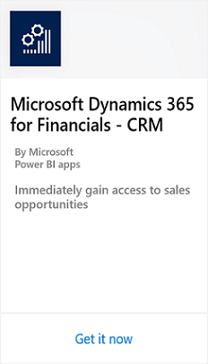
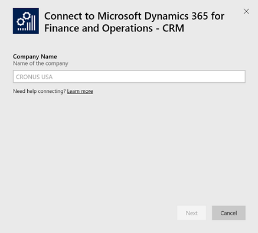
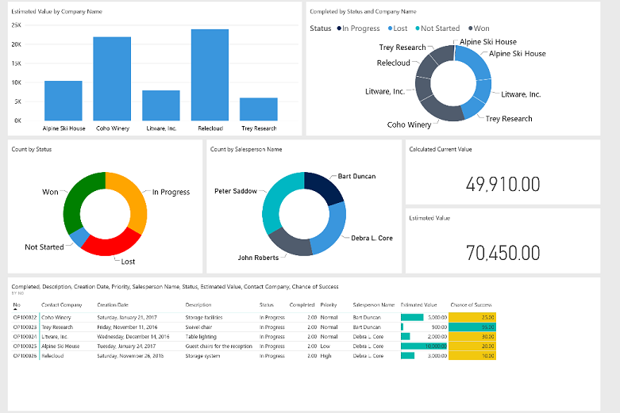

# Connecting Power BI to Finance and Operations, Business edition Content Packs
Getting insights into your Microsoft [!INCLUDE [d365fin_long_md](includes/d365fin_long_md.md)] data is easy with Power BI and the Microsoft [!INCLUDE [d365fin_long_md](includes/d365fin_long_md.md)] content packs. Power BI retrieves your data then builds an out-of-the-box dashboard and reports based on that data.

> [!NOTE]  
>  You must have a valid account with Dynamics 365 and with Power BI. Also, you must download [Power BI Desktop](https://powerbi.microsoft.com/en-us/desktop/).  
>  Power BI content packs require permissions to the tables where data is retrieved from. More details on the requirements are described below.  

## How to Connect
1. Select **Get Data** at the bottom of the left navigation pane.  
   
2. In the **Services** box, select **Get**. This will open a window with the **AppSource** and **Apps for Power BI apps**.  
   
3. Select **Apps** from the **Apps for Power BI apps** tab, and choose the **Microsoft Dynamics 365 for Finance and Operations** content pack that you want to use, and then select **Get it now**.  
   
4. When prompted, enter the name of *your company* in [!INCLUDE [d365fin_md](includes/d365fin_long_md.md)]. This is not the display name.  
   
5. Once connected, a dashboard, report and dataset will automatically be loaded into your Power BI workspace. When completed, the tiles will update with data from your account.
   

## What Now?

- Try [asking a question in the Q&A box](https://docs.microsoft.com/en-us/power-bi/service-q-and-a) at the top of the dashboard.  
- [Change the tiles](https://docs.microsoft.com/en-us/power-bi/service-dashboard-edit-tile) in the dashboard.  
- [Select a tile](https://docs.microsoft.com/en-us/power-bi/service-dashboard-tiles) to open the underlying report.  
- While your dataset will be scheduled to refreshed daily, you can change the refresh schedule or try refreshing it on demand using **Refresh Now**.

## System Requirements
To import your [!INCLUDE [d365fin_long_md](includes/d365fin_long_md.md)] data into Power BI, you need to have permissions to the web services used to retrieve data. The web services required for each content pack include:

**Microsoft Dynamics 365 for Finance and Operations, Business edition – CRM**
- SalesOpportunities
- ExcelTemplateViewCompany

**Microsoft Dynamics 365 for Finance and Operations, Business edition – Sales**
- ItemSalesbyCustomer
- SalesDashboard
- ExcelTemplateViewCompany

**Microsoft Dynamics 365 for Finance and Operations, Business edition – Finance**
- PowerBIFinance
- ExcelTemplateViewCompany

**Microsoft Dynamics 365 for Finance and Operations, Business edition – Jobs**
- Job List
- Job Planning Lines
- Job Task Lines

**Microsoft Dynamics 365 for Finance and Operations, Business edition – Customers List**
- ItemSalesbyCustomer
- Power_BI_Item_Purchase_List
- Power_BI_Item_Sales_List
- SalesDashboard
- Power_BI_Customer_List
- ExcelTemplateViewCompany

**Microsoft Dynamics 365 for Finance and Operations, Business edition – Items List**
- ItemSalesbyCustomer
- Power_BI_Item_Purchase_List
- Power_BI_Item_Sales_List
- Items
- SalesDashboard
- ExcelTemplateViewCompany

**Microsoft Dynamics 365 for Finance and Operations, Business edition – Vendors List**
- ItemSalesbyCustomer
- Power_BI_Item_Purchase_List
- Power_BI_Item_Sales_List
- Items
- SalesDashboard
- Power_BI_Customer_List
- ItemSalesbyCustomer
- Power_BI_Vendor_List
- ExcelTemplateViewCompany

## Web Services
An easy way to find the web services is to search for web services in [!INCLUDE [d365fin_long_md](includes/d365fin_long_md.md)]. In the list make sure the Publish box is marked for the web services listed above.

## Troubleshooting
The Power BI dashboard relies on the published web services that are listed above, and it will show data from the demonstration company or your own company if you import data from your current finance solution. However, if something goes wrong, this section provides a workaround for the most typical issues.

### Incorrect Company Name  
A common mistake is to enter the company display name instead of the company name. To find the company name search for **Companies**. Then use the **Name** field when entering your company name.

### Incorrect User Name and Password  
The user name and password used to connect will be the same as what is used to connect to your Microsoft Office 365 account.  

The content packs also require that you have a Microsoft [!INCLUDE [d365fin_long_md](includes/d365fin_long_md.md)] account. Once you enter your credentials, we will auto discover any Microsoft [!INCLUDE [d365fin_long_md](includes/d365fin_long_md.md)] tenants you have access to. If you do not have a licensed or trial Microsoft [!INCLUDE [d365fin_long_md](includes/d365fin_long_md.md)] account, you will receive an error message.

### The Key Didn't Match Any Rows in the Table
If you enter a non valid company name during the connection process, you may get the error message "The key didn't match any rows in the table". Provide the correct company name and try connecting again.

## See Also
[Get started with Power BI](https://docs.microsoft.com/en-us/power-bi/service-get-started)  
[Power BI - Basic Concepts](https://docs.microsoft.com/en-us/power-bi/service-basic-concepts)
[Business Intelligence](bi.md)  
[Welcome to [!INCLUDE[d365fin_long](includes/d365fin_long_md.md)]](index.md)  
[Importing Business Data from Other Finance Systems](across-import-data-configuration-packages.md)  
[Setting Up [!INCLUDE[d365fin](includes/d365fin_md.md)]](setup.md)  
[Finance](finance.md)  
[Setup Reporting for [!INCLUDE[d365fin](includes/d365fin_md.md)] in Power BI](across-how-use-financials-data-source-powerbi.md)  
