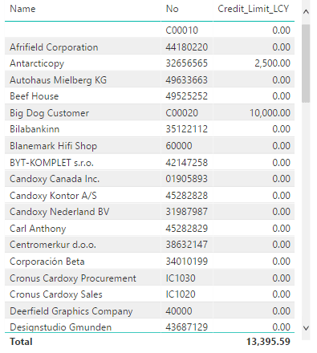

# Using [!INCLUDE[d365fin](includes/d365fin_md.md)] as a Power BI Data Source
You can make your [!INCLUDE[d365fin](includes/d365fin_md.md)] data available as a data source in Power BI and build powerful reports of the state of your business.  

> [!NOTE]  
>   You must have a valid account with [!INCLUDE[d365fin](includes/d365fin_md.md)] and with Power BI. Also, you must download [Power BI Desktop](https://powerbi.microsoft.com/en-us/desktop/).  
To set up a connection to Power BI, you must have the following:  

* Access to [!INCLUDE[d365fin](includes/d365fin_md.md)].  
* The OData endpoint for your [!INCLUDE[d365fin](includes/d365fin_md.md)] data. You can get this by copying the value of the **OData V4 URL** field in the **Web Services** window in [!INCLUDE[d365fin](includes/d365fin_md.md)].  
* The username and web service key for the account that you want to use for this connection. This can be your own account or that of another user. You can get this data from the **User** card in [!INCLUDE[d365fin](includes/d365fin_md.md)].  
* Access to Power BI. For more information, see [Power BI](https://powerbi.microsoft.com).  
* Power BI Desktop installed. For more information, see [Power BI Desktop](https://powerbi.microsoft.com/en-us/desktop/).  

## To connect to your [!INCLUDE[d365fin](includes/d365fin_md.md)] in Power BI Desktop
1. In Power BI Desktop, in the left navigation pane, choose **Get Data**.
2. In the **Get Data** window, search for [!INCLUDE[d365fin](includes/d365fin_md.md)], choose the related link, and then choose the **Connect** button.

   Power BI displays a wizard that will guide you though the connection process. The first step will be to enter an OData URL and the company name that is associated with your [!INCLUDE[d365fin](includes/d365fin_md.md)] account.  

   For the *OData URL*, you can copy the OData V4 URL of any of the web services that are listed in the **Web Services** page in [!INCLUDE[d365fin](includes/d365fin_md.md)], such as `https://mycompany.financials.dynamics.com:7048/MS/ODataV4/`.  

   For the *Company Name*, use the name that is shown in the **Name** field in the **Company Information** window in [!INCLUDE[d365fin](includes/d365fin_md.md)]. If your [!INCLUDE[d365fin](includes/d365fin_md.md)] contains multiple companies, choose the relevant company name from the list in the **Companies** window. In both cases, make sure that the name that you specify in the Power BI wizard matches exactly the text shown in [!INCLUDE[d365fin](includes/d365fin_md.md)], such as `My Company`.
3. Once you have entered the information, choose the OK button. The next step in the wizard will be to enter your username and password.

    > [!NOTE]  
    >    If there are other authentication options available in the left hand navigation, choose *Basic*.
4. Enter your username and password. You can find this information in the **Users** window in [!INCLUDE[d365fin](includes/d365fin_md.md)]. Use the **Web Access Key** as your password.

   For example, your username is *ADMIN*, and the web service access key that serves as your password is *EgzeUFQ9Uv0o5O0lUMyqCzo1ueUW9yRF3SsLU=*.
5.  Choose **Create**.  

   This establishes the connection. Next, you can build your first Power BI report. We'll start with a tabular report.  

## To build your Power BI report
1. In the **Navigator** window, choose your data set.  

    The window lists the available OData V4 web services, such as *Customer* for the published **Customers** page.  
2.  Choose **Load**.  
3.  Drag the fields that you want to see in the report to the Power BI canvas.  

    For example, your first report can look like this:
    
4.  When you are done with the report, choose **Publish**.  
5.  Specify a name for the .pbix file and the workspace that you want to publish the report to.  

When the file has been published, you will get a link to open the report in Power BI. Optionally, return to Power BI Desktop and enhance your first report. For more information, see the [Power BI documentation](https://powerbi.microsoft.com/documentation/powerbi-landing-page/).

## See Also
[Business Intelligence](bi.md)  
[Welcome to [!INCLUDE[d365fin_long](includes/d365fin_long_md.md)]](index.md)  
[Importing Business Data from Other Finance Systems](upload-data.md)  
[Setting Up [!INCLUDE[d365fin](includes/d365fin_md.md)]](setup.md)  
[Finance](finance.md)  
