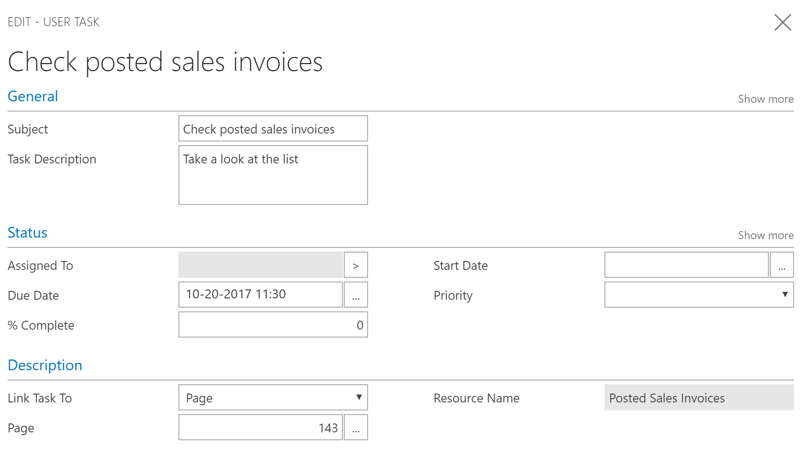

# Defining Tasks
In [!INCLUDE[d365fin](includes/d365fin_md.md)], you can create tasks to remind you of work to be done. You can create tasks for yourself, but you can also assign tasks to others or be assigned a task by someone else in your organization. In the Business Manager, Bookkeeper, and Accountant Role Centers, a tile shows pending tasks that are assigned to that user.  

## Managing Tasks
The **User Tasks** window shows all tasks, and you can easily create and assign new tasks. When you create a task, you can specify the start date and due date, and you can add a link to the window in [!INCLUDE[d365fin](includes/d365fin_md.md)] where the user must do the work.  

For example, you can create a task for yourself to view all posted sales invoices. In that case, you link the task to page 143, Posted Sales Invoices.  

> [!TIP]  
>  Use the look-up in the **Page** field and then use the **Search for Page or Report** field to find the page that you want. For more information, see [Searching for a Page or Report](ui-search.md).  

When you have completed a task, simply mark it as completed.

## See Also
[Accountant Experiences in [!INCLUDE[d365fin](includes/d365fin_md.md)]](finance-accounting.md)  
