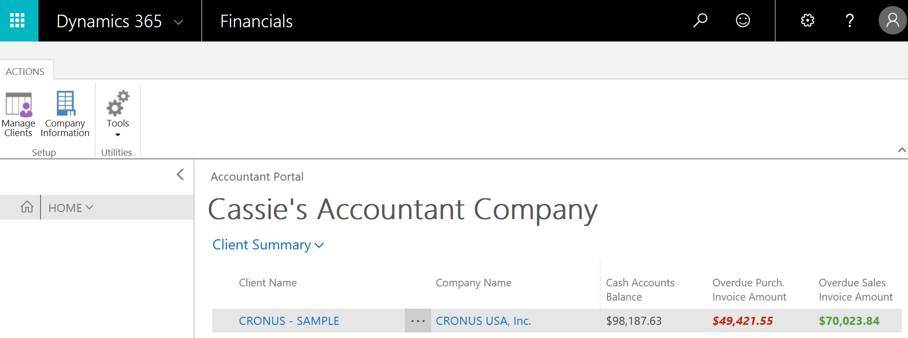

# Accountant Experiences in [!INCLUDE[d365fin](includes/d365fin_md.md)]
Any business must do its books and sign off on the accounting. Some businesses employ an external accountant, and others have an accountant on staff. No matter which type of accountant you are, you can use the **Accountant** Role Center as your Home in [!INCLUDE[d365fin](includes/d365fin_md.md)]. From here, you can access all windows that you need in your work.  

## Accountant Role Center
The Role Center is a dashboard with activity tiles that show you real-time key figures and give you quick access to data. In the ribbon at the top of the window, you have access to more actions. In the navigation pane to the left, you can quickly switch between the lists you use most often. If you expand the **Home** menu in the navigation pane, you will see other areas, such as **Posted Documents** with the various types of documents that the company has posted.  

If you are new to [!INCLUDE[d365fin](includes/d365fin_md.md)], you can launch a list of videos right from your Home page. You can also launch a **Getting Started** that points out key areas.  

> [!NOTE]  
>  This functionality requires that the experience is set to **Suite**. For more information, see [Customizing Your Financials Experience](ui-experiences.md).  

### Get Invited to a Client's [!INCLUDE[d365fin](includes/d365fin_md.md)]
A company who use [!INCLUDE[d365fin](includes/d365fin_md.md)] can invite you to [!INCLUDE[d365fin](includes/d365fin_md.md)] as their external accountant. This requires an administrator to add your work email address to their Active Directory tenant, and we recommend that they contact their [!INCLUDE[d365fin](includes/d365fin_md.md)] partner for assistance. Also, we recommend that you enter the email that you plan to use for your accounting work - that way, you can choose if you want to use *me@accountant.com* or *me@client.com*  

As a result, you may receive two emails:

-   One from Microsoft Invitations with a link to add yourself to your client's organization  
-   One from your client with a link to their [!INCLUDE[d365fin](includes/d365fin_md.md)]  

You can then access their financial data from the **Accountant** Role Center. If you use the **Accountant Portal*** extension, you can also add that client to your list of clients in the accountant portal dashboard.  

## Accountant Portal
If you are an accountant with several clients, you can use the accountant portal as your dashboard for a better overview of your clients. From there, you can access each client's tenant in [!INCLUDE[d365fin](includes/d365fin_md.md)] and use the Accountant Role Center as described above.  

The accountant portal is a dedicated version of [!INCLUDE[d365fin](includes/d365fin_md.md)]. You can get access to the portal by signing up from [Financials for Accountants on Microsoft.com](https://www.microsoft.com/en-us/dynamics365/financial-insights-for-accountants), and by adding the [Accountant Portal extension](ui-extensions-accountant-portal.md) to your [!INCLUDE[d365fin](includes/d365fin_md.md)].  

> [!TIP]  
>  When you sign up for the accountant portal, you must specify your work email address, such as *me@accountingfirm.com*. If you use the same email address when you work in your clients' [!INCLUDE[d365fin](includes/d365fin_md.md)], then each client will automatically be added to your dashboard in the accountant portal.  

When you first log in to the accountant portal, the dashboard shows a sample client to help you get started. Once you are comfortable, you can remove that sample client.  

### Working with Individual Clients
The dashboard shows the most important information about each client.  

The **Client Name** column shows the names of your clients, and the **Company Name** lists all companies if the client has more than one company in [!INCLUDE[d365fin](includes/d365fin_md.md)]. You can customize the dashboard to show the data points that you want to see by adding or removing columns. For example, you might want to see taxes that are due, how many open sales documents each client has, or the number of purchase invoices that are due next week.  

Next to the client name the three ellipses reveal a short menu:

-   Refresh the current company and get fresh data for the client  
-   Go to the client's [!INCLUDE[d365fin](includes/d365fin_md.md)]  
-   Select more clients  

Similarly, you can use the **Client Summary** drop-down menu to refresh all companies, for example.  

All other work that you do for each client, you can do in the Accountant Role Center in their [!INCLUDE[d365fin](includes/d365fin_md.md)].

### Adding Clients
If you have been invited to a client's [!INCLUDE[d365fin](includes/d365fin_md.md)] and signed in with your work account, then the client will be added to your dashboard in the accountant portal. But you can also add a client manually by using the **Clients** window, which you can open by choosing the **Manage Clients** action in the ribbon. Simply choose **New** and then fill in the fields. The data in the card for each client is specified by you, and you can change it as needed. However, the **Client URL** field is critical - this is how you can access each client's [!INCLUDE[d365fin](includes/d365fin_md.md)]. Use the **Test Client URL** action in the ribbon to test that you entered the right link. The URL that you must enter points at the client's [!INCLUDE[d365fin](includes/d365fin_md.md)], such as *https://mybusiness.financials.dynamics.com*.  

## See Also
[Finance](finance.md)  
[Setting Up Finance](finance-setup-finance.md)  
[The General Ledger and the Chart of Accounts](finance-general-ledger.md)  
[Closing Years and Periods](year-close-years-periods.md)  
[Working With [!INCLUDE[d365fin](includes/d365fin_md.md)]](ui-work-product.md)  
[Invite Your External Accountant to Your [!INCLUDE[d365fin](includes/d365fin_md.md)]](finance-invite-external-accountant.md)  
[Financials for Accountants on Microsoft.com](https://www.microsoft.com/en-us/dynamics365/financial-insights-for-accountants)  
