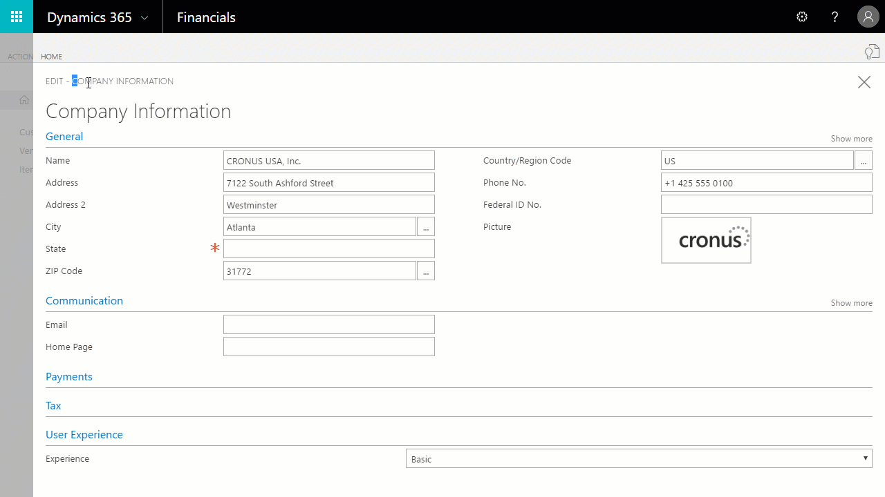

# Customizing Your Dynamics 365 for Financials Experience
[!INCLUDE[d365fin](includes/d365fin_md.md)] is designed to help you run your business, regardless which line of business you are in. At the core of [!INCLUDE[d365fin](includes/d365fin_md.md)], you find financial reporting and sales and purchasing processes. You add experiences to that according to your business needs by adding extensions from AppSource. You can also turn up and down the volume on the user experience and choose what's right for your company. For more information, see [Customizing [!INCLUDE[d365fin](includes/d365fin_md.md)] Using Extensions](ui-extensions.md).

## Choosing a user experience
The user experience determines how much of the core functionality is available when you and your colleagues use [!INCLUDE[d365fin](includes/d365fin_md.md)]. You can choose the user experience for your company in the **Company Information** window, in the **Experience** field.

**Note**: This setting applies to all users in your company.

The following table lists the experiences that are currently available.

| Experience | Impact on User Interface |
| --- | --- |
| Basic |Shows only core actions and fields for core business areas, such as sales, purchasing, finance, and opportunity management. |
| Suite |Shows more actions and fields for core business areas and for other areas, such as project management, fixed asset management, and analysis by dimensions. |

## See also
[Changing Basic Settings](ui-change-basic-settings.md)  
[Customizing [!INCLUDE[d365fin](includes/d365fin_md.md)] Using Extensions](ui-extensions.md)  
[Working With [!INCLUDE[d365fin](includes/d365fin_md.md)]](ui-work-product.md)
