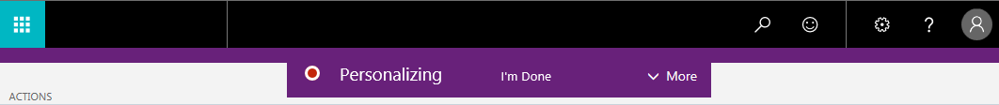

# Personalizing Pages
<!--NAV in the Web client-->
You can customize pages to better suit your daily work by changing their layout to display only the information you want, where you want it. Depending on the type of page and what it includes, you can:

-   Add, move, and remove fields.

    You cannot create new fields; you can only add fields that already exist in the database. The same is true for field columns in a list.
-   Add, move, and remove field columns in a list.
-   Change the freeze pane of field columns in a list. 

    The freeze pane defines the columns that always appear in the list, even when you scroll horizontally.
-   Move and remove parts.

    Parts are typically larger areas on a page that contain elements such as another page, a chart, or cues (tiles).  

Of course, the personalization changes that you make will only effect what you see, not what other users see. 

## To personalize a page

1. Choose the  icon, and then choose **Personalize**.

    The **Personalize Mode** bar appears at the top to indicate that you can start to making changes. 

    

    Choose **More** to see additional personalization actions.

2.  Go to a page that you want to personalize.

3.  Point to an area or component that you want to personalize, such as a field or column header in a list.

    -   If a component can be personalized, an arrow head ( or ) appears.
    -   If the component is a part, the extent of the part is indicated by a border. 
    -   The freeze pane in a list is indicated by a vertical line along the entire right-side of the last column of the freeze pane.

4.    Use this table to help make changes:
        <table>
        <tr><th>What do you want to do</td><th>How to do it</th></tr>
        <tr><td>Move the component, like a field, column in list, or part</td><td> Drag it by the arrowhead to its new location. The target location is indicated by either a thick horizontal or vertical line.</td></tr>
        <tr><td>Remove the component</td><td>Select the arrowhead, and choose <b>Remove</b>.</td></tr>
        <tr><td>Change the freeze pane in a list to another column</td><td>Select the arrowhead of the column that you want as the last column of the freeze pane, and then choose **Set Freeze Pane**.  If you do not want a freeze pane, select the arrowhead for the current freeze pane column, and choose **Clear Freeze Pane**.</td></tr></table>
    
    
   

<!--
4.  To remove the component, select the arrowhead, and choose **Remove**.
5.  To change the freeze pane in a list to another column, select the arrowhead of the column that you want as the last column of the freeze pane, and then choose **Set Freeze Pane**. If you do not want a freeze pane, select the arrowhead for the current freeze pane column, and choose **Clear Freeze Pane**. 
6.  To add a field, in the **Personalize Mode** bar, choose **More**, and then choose **Field**.

    The **Add Field to Page** pane opens on the right that list the fields that you can add to the page. Fields marked as **Placed** are already on the page. Fields marked as **Ready** are not currently on the page.

    To add a field, drag it from the pane to the location that you want it.

    > [!NOTE]  
    >   For lists, you cannot add field if the list is shown as tiles. To change the view, choose the show as list  icon.-->

7. You can continue to make changes on the same or other pages. When you are done, in the **Personalize Mode** bar, choose **Stop personalizing** to save the changes and exit the **Personalize Mode**. 

When you make changes to a card-type page, that is a page that displays information about a record, such as the Customer card or Item card, the changes will be seen on all similar records. For example, if you move . for 

## To restore pages to their original layout
At some point, you might want to undo all the personalization changes that you have made over time so that pages appear as they were originally designed. To do this, choose the  icon, **Personalize**, and then **Restore Defaults**.  

## See Also
[Working with [!INCLUDE[d365fin](includes/d365fin_md.md)]](ui-work-product.md)  
[How to: Change the Role Center](change-role.md)  
[Customizing Your [!INCLUDE[d365fin](includes/d365fin_md.md)] Experience](ui-experiences.md)  
